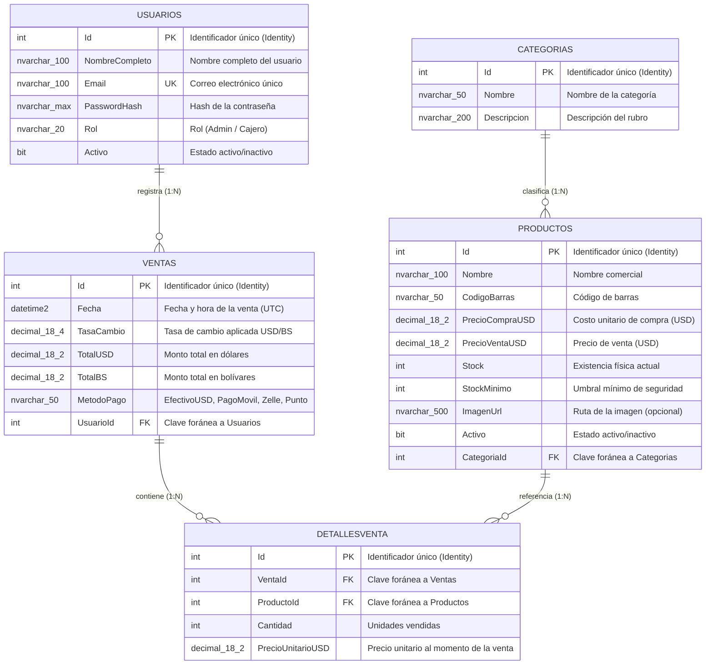

# Sistema de Gestión e Inventario para Licorería

### **Asignatura: Desarrollo de Aplicaciones Web (Código: 0423807T)**

**Estudiantes:** José García · Kelwuin Carrillo  
**Período Académico:** Septiembre, 2026  
**San Cristóbal, Estado Táchira, Venezuela**

---

## 📌 Descripción General

El presente proyecto constituye una solución de software empresarial orientada a la gestión integral de inventario, catalogación y punto de venta para el sector comercial de **licorería**.

El sistema permite administrar un catálogo organizado por categorías —**Licores, Gaseosas, Energizantes y Pasabocas**—, controlar las existencias físicas con alertas de **stock mínimo**, y registrar operaciones de **punto de venta** mediante los módulos de `Venta` y `DetalleVenta`, contemplando precios en dólares (**USD**) y su conversión a bolívares (**BS**) a través de la tasa de cambio.

La arquitectura del backend implementa estándares de desarrollo empresarial, aplicando **Onion Architecture** para lograr un desacoplamiento estricto entre el dominio del negocio y la infraestructura tecnológica, con captura global de excepciones estandarizada (**RFC 7807**).

---

## 🏛️ Arquitectura del Backend (Onion Architecture)

El backend se distribuye en una arquitectura por capas concéntricas, donde las capas internas no conocen a las externas (regla de dependencias):

```
┌────────────────────────────────────────────────────────┐
│                  Licoreria.WebAPI                      │
│    Controladores REST, Middlewares RFC 7807,           │
│    Inyección de Dependencias en Program.cs             │
├────────────────────────────────────────────────────────┤
│                  Licoreria.Application                 │
│          Contratos e Interfaces de Servicio            │
├────────────────────────────────────────────────────────┤
│                    Licoreria.Domain                    │
│         Entidades Puras del Negocio (Categoria,        │
│         Producto, Usuario, Venta, DetalleVenta)        │
├────────────────────────────────────────────────────────┤
│                Licoreria.Infrastructure                │
│      EF Core 10, SQL Server, LicoreriaDbContext,       │
│      Fluent API, Migraciones y Data Seeding            │
└────────────────────────────────────────────────────────┘
```

### Componentes Clave:

1. **Licoreria.Domain:** Contiene las entidades puras del negocio (`Categoria`, `Producto`, `Usuario`, `Venta`, `DetalleVenta`) sin dependencias de frameworks externos. El modelo utiliza identificadores enteros autoincrementales (`int Id`) definidos directamente en cada entidad.
2. **Licoreria.Application:** Define los contratos e interfaces de la capa de aplicación. Depende únicamente de `Licoreria.Domain`.
3. **Licoreria.Infrastructure:** Administra la persistencia con **Entity Framework Core 10**, la configuración relacional vía **Fluent API**, las **migraciones** y la siembra de datos (*data seeding*) a través de `LicoreriaDbContext`. Expone la extensión `AddInfrastructureServices` para el registro de dependencias.
4. **Licoreria.WebAPI:** Expone los controladores REST, registra los servicios en `Program.cs` (Inyección de Dependencias) y monta el **Middleware Global de Excepciones** como primera pieza de la tubería (*pipeline*) de la aplicación.

> **Nota de alcance (Fase 1):** El modelo de datos actual emplea claves primarias `int` autoincrementales en todas las entidades. La abstracción `BaseEntity` con `Id Guid` y `CreatedAt` UTC no forma parte del código de esta fase.

---

## ⚠️ Manejo Global de Errores (RFC 7807)

La solución implementa el componente `Licoreria.WebAPI/Middlewares/ExceptionMiddleware.cs`, encargado de interceptar cualquier excepción no controlada durante el procesamiento de la petición y transformarla en una respuesta estándar **`application/problem+json`** conforme al estándar **RFC 7807** (*Problem Details for HTTP APIs*).

### Comportamiento Implementado:

| Escenario | Excepción | Código HTTP | `Content-Type` |
| :--- | :--- | :---: | :--- |
| **Error no controlado** | Cualquier `Exception` no capturada | `500 Internal Server Error` | `application/problem+json` |

La respuesta generada expone los campos estándar de `ProblemDetails`:

```json
{
  "type": "https://datatracker.ietf.org/doc/html/rfc7231#section-6.6.1",
  "title": "Internal Server Error",
  "status": 500,
  "detail": "Mensaje descriptivo de la excepción capturada",
  "instance": "/ruta/de/la/peticion"
}
```

**Características del middleware:**
- Se registra como primera capa mediante `app.UseMiddleware<ExceptionMiddleware>();` en `Program.cs`.
- Registra el error a través de `ILogger<ExceptionMiddleware>` antes de responder al cliente.
- Serializa la respuesta en **camelCase** para mantener consistencia con el contrato REST.

> **Evolución prevista (fases posteriores):** El mapeo diferenciado de excepciones de negocio a códigos `400 Bad Request` (`InvalidOperationException`) y `404 Not Found` (`KeyNotFoundException`) queda contemplado como mejora futura del middleware.

---

## 🗄️ Modelo Entidad-Relación (Base de Datos SQL Server)

El esquema relacional mapeado a través de **Entity Framework Core 10 (Code-First + Fluent API)** se estructura de la siguiente manera:



**Reglas de integridad referencial configuradas:**

| Relación | Comportamiento en cascada |
| :--- | :--- |
| `Productos` → `Categorias` | `Restrict` (no elimina categorías con productos) |
| `Ventas` → `Usuarios` | `Restrict` (no elimina usuarios con ventas) |
| `DetallesVenta` → `Ventas` | `Cascade` (elimina detalles junto con la venta) |
| `DetallesVenta` → `Productos` | `Restrict` (no elimina productos vendidos) |

---

## 🚀 Tecnologías Empleadas

- **Backend:** .NET 10 (C#), ASP.NET Core Web API.
- **ORM & Base de Datos:** Entity Framework Core 10.0.12, Microsoft SQL Server (LocalDB).
- **Documentación de API:** Swashbuckle.AspNetCore 10.2.3 (Swagger UI).
- **Arquitectura:** Onion Architecture desacoplada en 4 proyectos.

---

## 🛠️ Requisitos Previos

Para ejecutar la aplicación en un entorno de desarrollo local se requiere:

- [SDK de .NET 10](https://dotnet.microsoft.com/download) (obligatorio para compilar y ejecutar la solución).
- **SQL Server LocalDB** (incluido con Visual Studio / SQL Server Express) o una instancia de SQL Server accesible.
- **Entity Framework Core Tools** para aplicar las migraciones (opcional):
  ```bash
  dotnet tool install --global dotnet-ef
  ```

---

## 📦 Guía de Ejecución (Fase 1)

Siga los siguientes pasos para compilar y ejecutar el backend localmente:

```bash
# 1. Clonar el repositorio
git clone <URL_DEL_REPO>
cd Licoreria-Backend-NET

# 2. Restaurar y compilar la solución
dotnet build

# 3. Aplicar las migraciones a la base de datos (opcional si la BD no existe)
dotnet ef database update --project Licoreria.Infrastructure --startup-project Licoreria.WebAPI

# 4. Ejecutar la API
dotnet run --project Licoreria.WebAPI
```

### Puntos de Acceso del Sistema:
- **Swagger UI:** `https://localhost:<puerto>/swagger` (disponible en entorno de desarrollo).
- **Endpoint de prueba:** `GET /WeatherForecast` — controlador de verificación de la API.
- **Cadena de conexión:** definida en `Licoreria.WebAPI/appsettings.json` (base de datos `LicoreriaDb` sobre `(localdb)\mssqllocaldb`).

---

## 🌱 Datos de Siembra (Data Seeding)

La migración inicial `InicializacionBaseDatos` incorpora datos de prueba para validar el modelo:

### Usuarios

| Rol | Nombre Completo | Email | Estado |
| :--- | :--- | :--- | :--- |
| **Admin** | Administrador Principal | `admin@licoreria.com` | Activo |
| **Cajero** | Cajero Turno Mañana | `cajero1@licoreria.com` | Activo |

### Categorías y Productos

| Categoría | Producto | Código de Barras | Precio Venta (USD) | Stock |
| :--- | :--- | :--- | :---: | :---: |
| Licores | Ron Cacique Añejo 0.75L | `759100100101` | 12.00 | 30 |
| Licores | Whisky Old Parr 12 Años 0.75L | `500028100202` | 38.00 | 12 |
| Gaseosas | Coca-Cola 2 Litros | `759100200303` | 2.50 | 50 |
| Energizantes | Red Bull 250ml | `900249010001` | 3.00 | 40 |
| Pasabocas | Doritos Queso Atrevido 150g | `759100400505` | 2.00 | 25 |

---

## 📂 Estructura del Repositorio

```
Licoreria-Backend-NET/
├── Licoreria-Backend-NET.slnx          # Solución principal de .NET (formato .slnx)
├── Licoreria.Domain/                   # Entidades puras del negocio
│   └── Entities/
│       ├── Categoria.cs
│       ├── Producto.cs
│       ├── Usuario.cs
│       ├── Venta.cs
│       └── DetalleVenta.cs
├── Licoreria.Application/              # Contratos e interfaces de servicio
├── Licoreria.Infrastructure/           # Persistencia y configuración técnica
│   ├── DependencyInjection.cs          # Registro de servicios de infraestructura
│   ├── Persistence/
│   │   └── LicoreriaDbContext.cs       # DbContext, Fluent API y Data Seeding
│   └── Migrations/                     # Migraciones de EF Core
├── Licoreria.WebAPI/                   # Capa de presentación (API REST)
│   ├── Controllers/
│   ├── Middlewares/
│   │   └── ExceptionMiddleware.cs      # Captura global de excepciones (RFC 7807)
│   ├── Program.cs                      # Configuración e Inyección de Dependencias
│   └── appsettings.json                # Cadena de conexión y configuración
└── README.md                           # Documentación principal del proyecto
```

---

## 📸 Evidencias de Evaluación (Fase 1)

A continuación se presenta el espacio destinado a las evidencias de validación de la **Fase 1**, en particular la verificación de la respuesta estandarizada **RFC 7807** del Middleware Global de Excepciones mediante **Postman**.

### Evidencia 1: Respuesta RFC 7807 (`application/problem+json`)

*Descripción:* Captura de pantalla de Postman donde se evidencia el encabezado `Content-Type: application/problem+json`, el código de estado `500 Internal Server Error` y el cuerpo JSON con los campos `type`, `title`, `status`, `detail` e `instance`.

> **📎 Insertar aquí la captura de pantalla:**
>
> ``

---

## 🗓️ Historial de Entregas por Fase

| Fase | Alcance | Tag de Git / Release | Estado |
| :---: | :--- | :--- | :---: |
| **Fase 1** | Estructura Onion Architecture, entidades del dominio, persistencia EF Core, Middleware RFC 7807 e Inyección de Dependencias. | _Pendiente_ | _En evaluación_ |
| **Fase 2** | _Por definir_ | _Pendiente_ | _No iniciada_ |
| **Fase 3** | _Por definir_ | _Pendiente_ | _No iniciada_ |

> **Nota:** Los Tags / Releases de Git se registrarán a medida que se cierre y apruebe cada fase.
