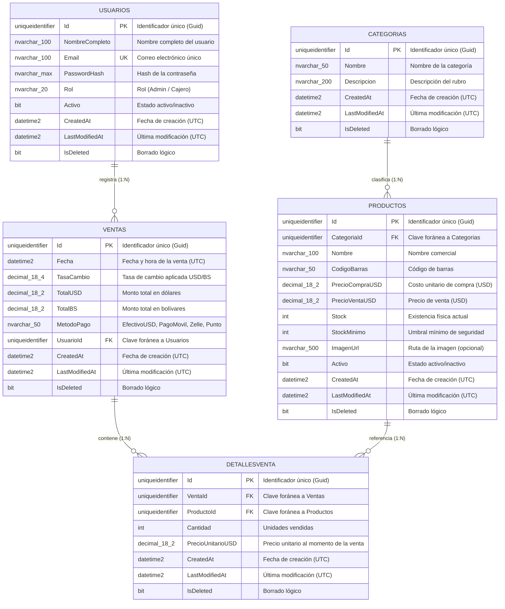
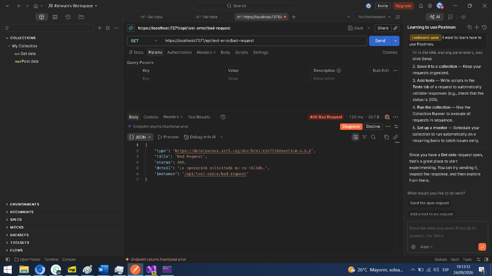
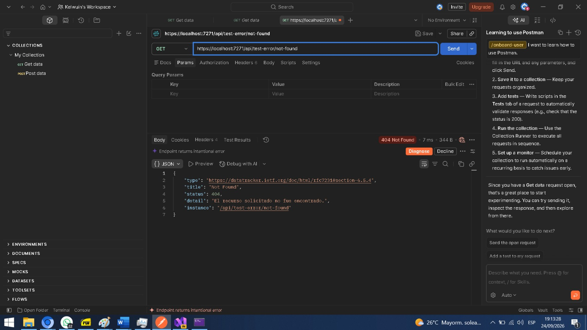

# Sistema de Gestión e Inventario para Licorería

### **Asignatura: Desarrollo de Aplicaciones Web (Código: 0423807T)**

**Estudiantes:** José García · Kelwuin Carrillo  
**Período Académico:** Septiembre, 2026  
**San Cristóbal, Estado Táchira, Venezuela**

---

## 📌 Descripción General

El presente proyecto constituye una solución de software empresarial orientada a la gestión integral de inventario, catalogación y punto de venta para el sector comercial de **licorería**.

El sistema permite administrar un catálogo organizado por categorías —**Licores, Gaseosas, Energizantes y Pasabocas**—, controlar las existencias físicas con alertas de **stock mínimo**, y registrar operaciones de **punto de venta** mediante los módulos de `Venta` y `DetalleVenta`, contemplando precios en dólares (**USD**) y su conversión a bolívares (**BS**) a través de la tasa de cambio.

La arquitectura del backend implementa estándares de desarrollo empresarial, aplicando **Onion Architecture** para lograr un desacoplamiento estricto entre el dominio del negocio y la infraestructura tecnológica, con captura global de excepciones estandarizada (**RFC 7807**).

---

## 🏛️ Arquitectura del Backend (Onion Architecture)

El backend se distribuye en una arquitectura por capas concéntricas, donde las capas internas no conocen a las externas (regla de dependencias):

```
┌────────────────────────────────────────────────────────┐
│                  Licoreria.WebAPI                      │
│    Controladores REST, Middlewares RFC 7807,           │
│    Inyección de Dependencias en Program.cs             │
├────────────────────────────────────────────────────────┤
│                  Licoreria.Application                 │
│      Contratos e Interfaces (IRepository<T>,           │
│      ICategoriaRepository, IProductoRepository)        │
├────────────────────────────────────────────────────────┤
│                    Licoreria.Domain                    │
│    BaseEntity (Guid + Auditoría UTC) y Entidades       │
│    (Categoria, Producto, Usuario, Venta, DetalleVenta) │
├────────────────────────────────────────────────────────┤
│                Licoreria.Infrastructure                │
│   EF Core 10, SQL Server, LicoreriaDbContext,          │
│   Repositorios, Fluent API, Migraciones y Data Seeding │
└────────────────────────────────────────────────────────┘
```

### Componentes Clave:

1. **Licoreria.Domain:** Contiene las entidades puras del negocio (`Categoria`, `Producto`, `Usuario`, `Venta`, `DetalleVenta`), sin dependencias de frameworks externos. Todas heredan de la clase abstracta `BaseEntity`, que centraliza la identidad y la trazabilidad.
2. **Licoreria.Application:** Define los contratos e interfaces de la capa de aplicación (`IRepository<T>`, `ICategoriaRepository`, `IProductoRepository`). Depende únicamente de `Licoreria.Domain`.
3. **Licoreria.Infrastructure:** Administra la persistencia con **Entity Framework Core 10**, la configuración relacional vía **Fluent API**, las **migraciones**, la siembra de datos (*data seeding*) y la implementación de los repositorios sobre `LicoreriaDbContext`.
4. **Licoreria.WebAPI:** Expone los controladores REST, registra los servicios en `Program.cs` (Inyección de Dependencias) y monta el **Middleware Global de Excepciones** como primera pieza de la tubería (*pipeline*) de la aplicación.

### Clase Base y Trazabilidad UTC

`Licoreria.Domain/Common/BaseEntity.cs` define el contrato de identidad y auditoría común a todas las entidades:

| Propiedad | Tipo | Descripción |
| :--- | :--- | :--- |
| `Id` | `Guid` | Clave primaria generada automáticamente (`Guid.NewGuid()`). |
| `CreatedAt` | `DateTime` | Fecha de creación en **UTC** (`DateTime.UtcNow`). |
| `LastModifiedAt` | `DateTime?` | Fecha de última modificación en **UTC** (opcional). |
| `IsDeleted` | `bool` | Bandera de borrado lógico (*soft delete*), por defecto `false`. |

```csharp
public abstract class BaseEntity
{
    public Guid Id { get; protected set; } = Guid.NewGuid();
    public DateTime CreatedAt { get; protected set; } = DateTime.UtcNow;
    public DateTime? LastModifiedAt { get; protected set; }
    public bool IsDeleted { get; protected set; } = false;
}
```

---

## ⚠️ Manejo Global de Errores (RFC 7807)

La solución implementa el componente `Licoreria.WebAPI/Middlewares/ExceptionMiddleware.cs`, encargado de interceptar cualquier excepción no controlada durante el procesamiento de la petición y transformarla en una respuesta estándar **`application/problem+json`** conforme al estándar **RFC 7807** (*Problem Details for HTTP APIs*).

### Mapeo de Excepciones:

| Excepción | Código HTTP | `Title` | `Type` (RFC 7231) |
| :--- | :---: | :--- | :--- |
| `KeyNotFoundException` | `404 Not Found` | Not Found | `#section-6.5.4` |
| `InvalidOperationException` | `400 Bad Request` | Bad Request | `#section-6.5.1` |
| `Exception` no controlada | `500 Internal Server Error` | Internal Server Error | `#section-6.6.1` |

La respuesta generada expone los campos estándar de `ProblemDetails`:

```json
{
  "type": "https://datatracker.ietf.org/doc/html/rfc7231#section-6.5.4",
  "title": "Not Found",
  "status": 404,
  "detail": "El recurso solicitado no fue encontrado.",
  "instance": "/api/test-error/not-found"
}
```

**Características del middleware:**
- Se registra como primera capa mediante `app.UseMiddleware<ExceptionMiddleware>();` en `Program.cs`.
- Registra el error a través de `ILogger<ExceptionMiddleware>` antes de responder al cliente.
- Serializa la respuesta en **camelCase** para mantener consistencia con el contrato REST.
- **Seguridad:** en errores `500` bajo el entorno `Production` se oculta el mensaje técnico y el *Stack Trace*, devolviendo un detalle genérico para no exponer información interna.

### Endpoints de Prueba del Middleware:

El controlador `TestErrorController` permite evidenciar el comportamiento desde Swagger/Postman:

| Método y Ruta | Excepción Disparada | Respuesta Esperada |
| :--- | :--- | :---: |
| `GET /api/test-error/not-found` | `KeyNotFoundException` | `404` |
| `GET /api/test-error/bad-request` | `InvalidOperationException` | `400` |
| `GET /api/test-error/server-error` | `Exception` genérica | `500` |

---

## 🗄️ Modelo Entidad-Relación (Base de Datos SQL Server)

El esquema relacional mapeado a través de **Entity Framework Core 10 (Code-First + Fluent API)** se estructura de la siguiente manera:



**Reglas de integridad referencial configuradas:**

| Relación | Comportamiento en cascada |
| :--- | :--- |
| `Productos` → `Categorias` | `Restrict` (no elimina categorías con productos) |
| `Ventas` → `Usuarios` | `Restrict` (no elimina usuarios con ventas) |
| `DetallesVenta` → `Ventas` | `Cascade` (elimina detalles junto con la venta) |
| `DetallesVenta` → `Productos` | `Restrict` (no elimina productos vendidos) |

---

## 🚀 Tecnologías Empleadas

- **Backend:** .NET 10 (C#), ASP.NET Core Web API.
- **ORM & Base de Datos:** Entity Framework Core 10.0.12, Microsoft SQL Server (LocalDB).
- **Documentación de API:** Swashbuckle.AspNetCore 10.2.3 (Swagger UI).
- **Patrones:** Onion Architecture, Repository Pattern, Dependency Injection.

---

## 🛠️ Requisitos Previos

Para ejecutar la aplicación en un entorno de desarrollo local se requiere:

- [SDK de .NET 10](https://dotnet.microsoft.com/download) (obligatorio para compilar y ejecutar la solución).
- **SQL Server LocalDB** (incluido con Visual Studio / SQL Server Express) o una instancia de SQL Server accesible.
- **Entity Framework Core Tools** para aplicar las migraciones (opcional):
  ```bash
  dotnet tool install --global dotnet-ef --version 10.0.12
  ```

---

## 📦 Guía de Ejecución (Fase 1)

Siga los siguientes pasos para compilar y ejecutar el backend localmente:

```bash
# 1. Clonar el repositorio
git clone <URL_DEL_REPO>
cd Licoreria-Backend-NET

# 2. Restaurar y compilar la solución
dotnet build

# 3. Aplicar las migraciones a la base de datos (opcional si la BD no existe)
dotnet ef database update --project Licoreria.Infrastructure --startup-project Licoreria.WebAPI

# 4. Ejecutar la API
dotnet run --project Licoreria.WebAPI
```

### Puntos de Acceso del Sistema:
- **Swagger UI:** `https://localhost:7271/swagger` o `http://localhost:5190/swagger` (entorno de desarrollo).
- **Endpoint de prueba general:** `GET /WeatherForecast`.
- **Endpoints de excepciones:** `GET /api/test-error/{not-found | bad-request | server-error}`.
- **Cadena de conexión:** definida en `Licoreria.WebAPI/appsettings.json` (base de datos `LicoreriaDb` sobre `(localdb)\mssqllocaldb`).

### Migraciones (historial preservado):

| # | Migración | Descripción |
| :---: | :--- | :--- |
| 1 | `20260923204525_InicializacionBaseDatos` | Esquema inicial con claves `int` y datos semilla. |
| 2 | `20260923221542_AdaptacionBaseEntityGuid` | Migración incremental a claves `Guid` + auditoría UTC (`BaseEntity`). |

---

## 🌱 Datos de Siembra (Data Seeding)

Las migraciones incorporan datos de prueba con identificadores `Guid` fijos para garantizar su determinismo:

### Usuarios

| Rol | Nombre Completo | Email | Estado |
| :--- | :--- | :--- | :--- |
| **Admin** | Administrador Principal | `admin@licoreria.com` | Activo |
| **Cajero** | Cajero Turno Mañana | `cajero1@licoreria.com` | Activo |

### Categorías y Productos

| Categoría | Producto | Código de Barras | Precio Venta (USD) | Stock |
| :--- | :--- | :--- | :---: | :---: |
| Licores | Ron Cacique Añejo 0.75L | `759100100101` | 12.00 | 30 |
| Licores | Whisky Old Parr 12 Años 0.75L | `500028100202` | 38.00 | 12 |
| Gaseosas | Coca-Cola 2 Litros | `759100200303` | 2.50 | 50 |
| Energizantes | Red Bull 250ml | `900249010001` | 3.00 | 40 |
| Pasabocas | Doritos Queso Atrevido 150g | `759100400505` | 2.00 | 25 |

---

## 📂 Estructura del Repositorio

```
Licoreria-Backend-NET/
├── Licoreria-Backend-NET.slnx          # Solución principal de .NET (formato .slnx)
├── Licoreria.Domain/                   # Capa de dominio (pura, sin dependencias)
│   ├── Common/
│   │   └── BaseEntity.cs               # Guid + CreatedAt/LastModifiedAt/IsDeleted
│   └── Entities/
│       ├── Categoria.cs
│       ├── Producto.cs
│       ├── Usuario.cs
│       ├── Venta.cs
│       └── DetalleVenta.cs
├── Licoreria.Application/              # Contratos e interfaces de la aplicación
│   └── Interfaces/
│       ├── IRepository.cs
│       ├── ICategoriaRepository.cs
│       └── IProductoRepository.cs
├── Licoreria.Infrastructure/           # Persistencia e implementación técnica
│   ├── DependencyInjection.cs          # Registro de DbContext y repositorios (Scoped)
│   ├── Persistence/
│   │   └── LicoreriaDbContext.cs       # DbContext, Fluent API y Data Seeding
│   ├── Repositories/
│   │   ├── Repository.cs               # Implementación genérica
│   │   ├── CategoriaRepository.cs
│   │   └── ProductoRepository.cs
│   └── Migrations/                     # Migraciones de EF Core (historial preservado)
├── Licoreria.WebAPI/                   # Capa de presentación (API REST)
│   ├── Controllers/
│   │   ├── WeatherForecastController.cs
│   │   └── TestErrorController.cs      # Endpoints de prueba de excepciones
│   ├── Middlewares/
│   │   └── ExceptionMiddleware.cs      # Captura global RFC 7807 (400/404/500)
│   ├── Program.cs                      # Configuración e Inyección de Dependencias
│   └── appsettings.json                # Cadena de conexión y configuración
└── README.md                           # Documentación principal del proyecto
```

---

## 📸 Evidencias de Evaluación (Fase 1)

A continuación se presenta el espacio destinado a las evidencias de validación de la **Fase 1**, en particular la verificación de la respuesta estandarizada **RFC 7807** del Middleware Global de Excepciones mediante **Postman**.

### Evidencia 1: Respuesta RFC 7807 (`application/problem+json`)

*Descripción:* Captura de pantalla de Postman donde se evidencia el encabezado `Content-Type: application/problem+json`, el código de estado correspondiente y el cuerpo JSON con los campos `type`, `title`, `status`, `detail` e `instance`.

> **📎 Insertar aquí la captura de pantalla:**
> 
> 
> ``

---

### 🧪 Colección de Pruebas de Postman
La colección completa con las pruebas de los endpoints en formato .jason para esta fase se encuentra disponible en el repositorio en la siguiente ruta:
* [`Licoreria_Fase1_Postman_Collection.json`](Licoreria.WebAPI/docs/Licoreria_Fase1_Postman_Collection.json)

---

## 🗓️ Historial de Entregas por Fase

| Fase | Alcance | Tag de Git / Release | Estado |
| :---: | :--- | :--- | :---: |
| **Fase 1** | Estructura Onion Architecture, `BaseEntity` (Guid/UTC), persistencia EF Core, Middleware RFC 7807, repositorios e Inyección de Dependencias. | _Pendiente_ | _En evaluación_ |
| **Fase 2** | _Por definir_ | _Pendiente_ | _No iniciada_ |
| **Fase 3** | _Por definir_ | _Pendiente_ | _No iniciada_ |

> **Nota:** Los Tags / Releases de Git se registrarán a medida que se cierre y apruebe cada fase.
