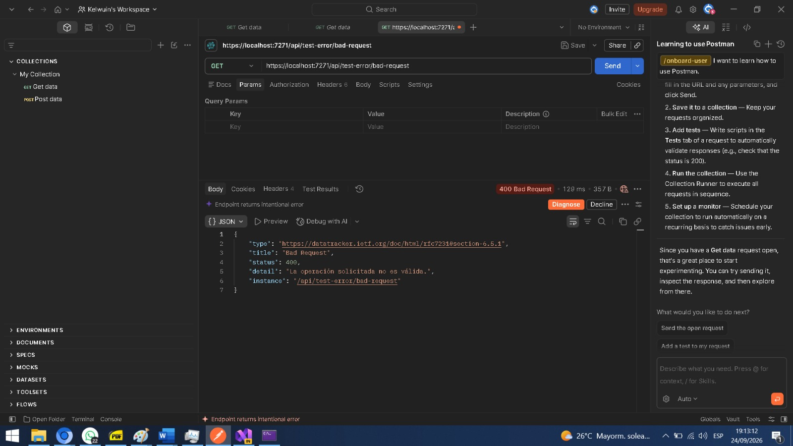
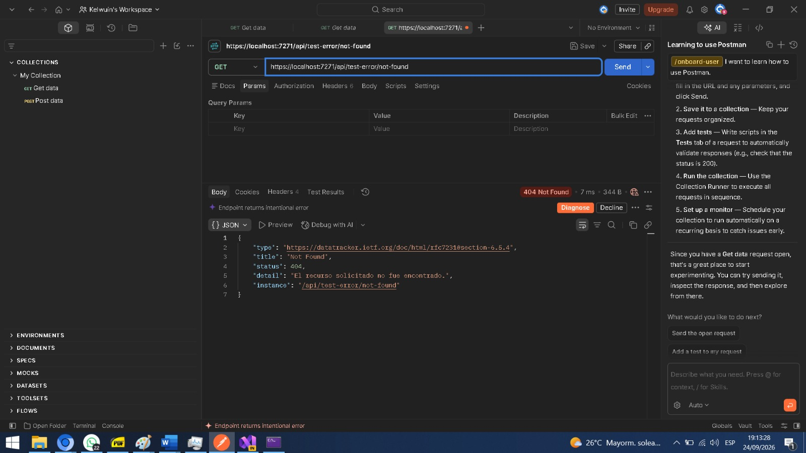
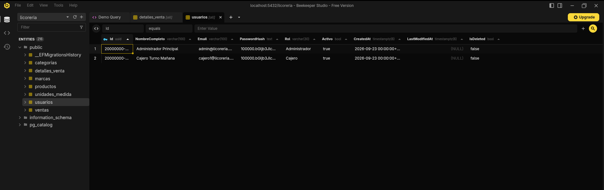
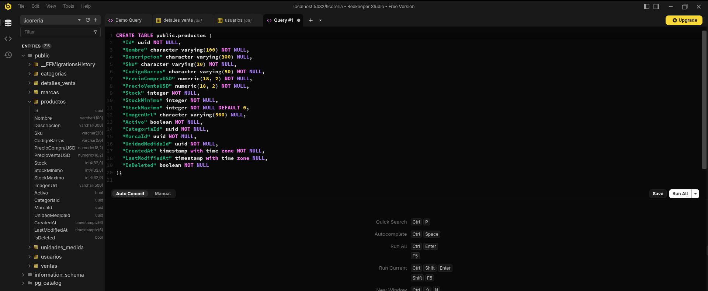
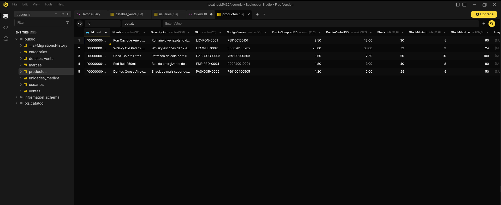

# Licorería / Discoteca · Plataforma Web

Plataforma web integral para la gestión de un local de **licorería y discoteca**
(una sola sucursal): web pública para clientes y sistema interno para el personal.

> **Backend** .NET 10 con **Onion Architecture** · **Base de datos** PostgreSQL ·
> **Frontend** React + Tailwind CSS · **IA** aplicada al negocio.

---

## Documentación

| Recurso | Descripción |
| :--- | :--- |
| [Documentación técnica](docs/dev/README.md) | Visión, requerimientos, arquitectura, modelo de datos, API, seguridad, módulos, IA y guías. |
| [Evidencias por fase](docs/assets/evidencias/README.md) | Capturas y colecciones Postman de Fases 1, 2 y 3. |
| [Sitio de documentación](docs/site) | Sitio Astro Starlight (secciones *Desarrolladores* y *Cliente*). |
| [Contrato OpenAPI](openapi/licoreria.yaml) | Especificación de la API v1 (contract-first). |
| [Guía de contribución](CONTRIBUTING.md) | Flujo de trabajo, ramas y commits. |
| [CHANGELOG](CHANGELOG.md) | Historial de cambios del repositorio. |

---

## Estructura del monorepo

```
.
├── backend/          # Solución .NET (Onion: Domain, Application, Infrastructure, WebAPI)
├── frontend/         # Apps React (admin, public-web, servicio) y paquetes compartidos
├── database/         # Scripts PostgreSQL, seeds y diagramas
├── openapi/          # Contrato OpenAPI de la API
├── docs/             # Documentación
│   ├── dev/          #   Documentación técnica canónica (GitHub)
│   └── site/         #   Sitio Astro Starlight (dev + cliente)
├── infra/            # Despliegue (docker, nginx, terraform)
└── .github/          # CI/CD, plantillas y CODEOWNERS
```

La documentación vive **aislada** en `docs/`, de modo que no interfiere con el flujo de
desarrollo de `backend/`, `frontend/` y `database/`.

---

## Arquitectura (resumen)

Onion Architecture con dependencias hacia el dominio:

```
WebAPI → Application → Domain
              ↑
        Infrastructure
```

Detalle en [docs/dev/02-arquitectura](docs/dev/02-arquitectura/onion.md).

---

## Puesta en marcha

```bash
# Backend
dotnet build backend/Licoreria.slnx
dotnet test backend/Licoreria.slnx
dotnet run --project backend/src/Licoreria.WebAPI

# Base de datos local (PostgreSQL, objetivo de la Fase 2)
docker compose up -d postgres

# Documentación
cd docs/site && npm install && npm run dev
```

> El proyecto incluye un `Taskfile.yml` con atajos: `task --list`.
> La persistencia usa **PostgreSQL** (ver `docker-compose.yml`); las migraciones se
> aplican automáticamente al arrancar la API.

---

## Fase 1 · Fundamentos y resiliencia REST

Lo logrado:

- **Onion Architecture** en 4 proyectos (`Domain` sin dependencias de frameworks).
- **Inyección de dependencias** con ciclos de vida `Transient`, `Scoped` y `Singleton`
  y validación de scopes (sin dependencias cautivas).
- **Middleware global RFC 7807** (`application/problem+json`) con títulos en español,
  mapeo de `404/400/401/500` y ocultamiento de trazas en producción.
- **CORS** configurable desde `appsettings.json` para el frontend React.
- **Lógica de dominio** con C# 14: salud de stock, generador de SKU, cuenta/abonos,
  merma/cortesía, conversión de moneda, estados de comanda y conflictos de reserva.
- **61 pruebas unitarias** (xUnit) ejecutadas correctamente.

### Evidencia (RFC 7807 · Postman)





Colección: [`Licoreria_Fase1_Postman_Collection.json`](docs/assets/evidencias/Licoreria_Fase1_Postman_Collection.json).

📄 [Ver documentación detallada de la Fase 1 →](docs/dev/10-fases/fase-1.md)

---

## Fase 2 · Persistencia PostgreSQL 15

Lo logrado:

- **PostgreSQL 15** con Npgsql, migraciones versionadas y `MigrateAsync` al arrancar.
- **Fluent API** por entidad (tablas en minúsculas, UUID, `numeric(18,2)`, índice único
  en `Sku`, `DeleteBehavior.Restrict`), sin Data Annotations en el dominio.
- **Data seeding** de categorías, marcas, unidades, productos y usuarios.
- Repositorios con **`AsNoTracking`** y script DDL en
  [`database/scripts/initial-infrastructure-catalog.sql`](database/scripts/initial-infrastructure-catalog.sql).

### Evidencia (PostgreSQL · DBeaver)

**Tablas creadas:**



**DDL con restricciones (UUID, `numeric(18,2)`, PK/FK, único):**



**Datos sembrados:**



📄 [Ver documentación detallada de la Fase 2 →](docs/dev/10-fases/fase-2.md)

## Fase 3 · Seguridad JWT, RBAC y validación

Lo logrado:

- Login `POST /api/auth/login` con **JWT HMAC-SHA256** y contraseñas **PBKDF2 + salt**.
- **RBAC**: `Admin` (CRUD total) y `Employee` (sin eliminación).
- **401** sin token y **403** con rol insuficiente.
- Validación con **FluentValidation** → **400** con errores por campo.

Credenciales de prueba (todas con la misma contraseña `demo123`):
`admin@licoreria.com` (Admin), `cajero1@licoreria.com` (Employee), `mesero1@licoreria.com`,
`barra1@licoreria.com`, `cocina1@licoreria.com`, `host1@licoreria.com` y `editor1@licoreria.com`.

### Evidencia (Postman)

| Login Admin | Login Employee |
| :---: | :---: |
|  |  |

**Listar productos con Employee (200):**


**Endpoint protegido sin token (401):**


**Eliminar con rol Employee (403):**


**Producto con precio negativo (400 con validación):**


Colección: [`Licoreria_Fase3_Postman_Collection.json`](docs/assets/evidencias/Licoreria_Fase3_Postman_Collection.json).

📄 [Ver documentación detallada de la Fase 3 →](docs/dev/10-fases/fase-3.md)

---

## Fase 4 · Frontend React + Docker

SPA construida con **React 18 + TypeScript + Vite + Tailwind CSS**, organizada como
monorepo npm con workspaces: `apps/admin` (panel interno), `apps/public-web` (sitio
público, tema "Hungry Tiger" con vitrina 3D) y `apps/servicio` (mesonero/KDS en
tiempo real), más paquetes compartidos (`types`, `api-client`, `ui`, `auth`, `config`).

Lo logrado:

- **Componentización por funcionalidad:** `pages/` por pantalla, `components/` por
  dominio (POS, catálogo, mapa, eventos…) y design system propio en `packages/ui`
  (tokens lavanda + familias pastel de estado, `DESIGN.md`).
- **Enrutamiento** con `react-router-dom` v6; rutas protegidas por sesión y permisos
  (`ProtectedRoute` + `ContenidoProtegido` con RBAC y **filtrado por modo**).
- **Gestión de estado en 3 niveles:** local (`useState`/hooks como `usePos`),
  global con Context API (`AuthContext`, `ThemeContext`, `ModoContext`) y de
  servidor con **TanStack Query** (caché, reintentos, invalidación).
- **HTTP asíncrono** centralizado en `packages/api-client` (wrapper de `fetch`):
  JWT automático, refresh silencioso ante 401 y errores **RFC 7807** → toasts;
  tiempo real con **SignalR** (`/hubs/comandas`).
- **Autenticación JWT:** access + refresh token; `AuthContext` persiste la sesión en
  `localStorage` y el `api-client` adjunta `Authorization: Bearer`.
- **Modo dual Licorería/Discoteca:** `ModoProvider` + filtrado de navegación por grupos
  (licorería oculta Salón/`/plano`/`/cuentas`; discoteca = nav completa).
- **Operación completa:** POS con teclado, KDS con SignalR, cuentas/comandas, plano
  interactivo, reservas VIP con señas, mermas/cortesías, caja (arqueo Z), reportes
  con heatmap y **pagos mixtos USD/Bs** con tasa vigente.
- **Pruebas frontend:** Vitest + React Testing Library + MSW (42 tests) y
  **backend:** xUnit + Moq (116 tests) con aislamiento de capas por interfaces.
- **Docker:** `docker compose up -d --build` levanta `postgres`, `api` (aplica
  migraciones + seed), `admin`, `public-web` y `edge` (nginx con WebSocket).

Tecnologías: Vite · React 18 · TypeScript · Tailwind CSS · TanStack Query ·
React Hook Form + Zod · Recharts · SignalR client · dnd-kit · React Three Fiber ·
Vitest + RTL + MSW · xUnit + Moq.

📄 [Ver documentación detallada de la Fase 4 (implementación y defensa) →](docs/dev/10-fases/fase-4.md)

---

## API final · Núcleo operativo y web pública

La API v1 está implementada sobre PostgreSQL con Onion Architecture. Incluye:

- **Seguridad:** refresh tokens, `/auth/me`, RBAC con permisos `modulo:accion` y gestión de usuarios.
- **Catálogo:** productos con variantes, códigos de barras, precios por lista, recetas y
  modificadores/extras por producto.
- **Inventario:** kardex inmutable, mermas/cortesías, ajustes, lotes/vencimientos y tomas físicas.
- **Compras:** proveedores, órdenes, recepciones (actualizan inventario/costos) y cuentas por pagar.
- **Operación:** ventas con pago mixto y comprobante, cuentas/comandas, caja con arqueo (Z),
  club/reservas, lista VIP, entradas y CRM.
- **Reportes:** tablero de KPIs, ventas por período/usuario/método de pago, inventario
  valorizado, compras y propinas por usuario.
- **Web pública:** contenido, menú digital, QR, menú PDF, WhatsApp, tasas y eventos.
- **Tiempo real:** SignalR en `/hubs/comandas`. **IA:** módulo simulado con aprobación.
- **Calidad:** concurrencia optimista (`xmin`), auditoría, rate limiting, pruebas unitarias
  y de integración, y contrato OpenAPI generado desde el código (`task backend:openapi`).

| Recurso | Descripción |
| :--- | :--- |
| [Guía para el frontend](docs/dev/04-api/guia-frontend.md) | Cómo consumir la API (auth, errores, paginación, SignalR). |
| [Contrato OpenAPI](openapi/licoreria.yaml) | Contrato generado desde el código. |
| Swagger (dev) | `http://localhost:5190/swagger`. |

---

## Fases del proyecto

| Fase | Alcance | Estado |
| :---: | :--- | :---: |
| 1 | Fundamentos, DI, RFC 7807 y dominio | Completada |
| 2 | Persistencia PostgreSQL 15 y seeding | Completada |
| 3 | Seguridad JWT / RBAC y validación | Completada |
| 4 | Frontend React + Docker | Completada |
| 5 | Despliegue | Pendiente |

> **Nota:** Las fases de desarrollo académico se rigen por lo indicado por el docente.
> Las mejoras de estructura, documentación e infraestructura de este repositorio son
> independientes de dichas fases. Ver [roadmap](docs/dev/10-fases/roadmap.md).

---

## Contribuir

Lee la [guía de contribución](CONTRIBUTING.md) y la
[convención de commits](docs/dev/11-guias/commits.md) antes de abrir un Pull Request.
