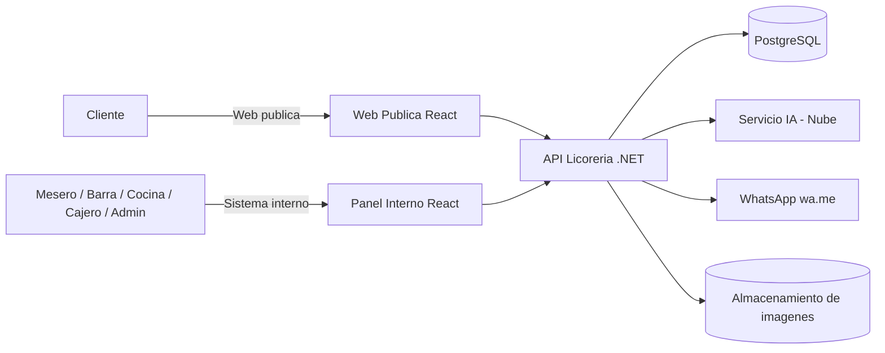
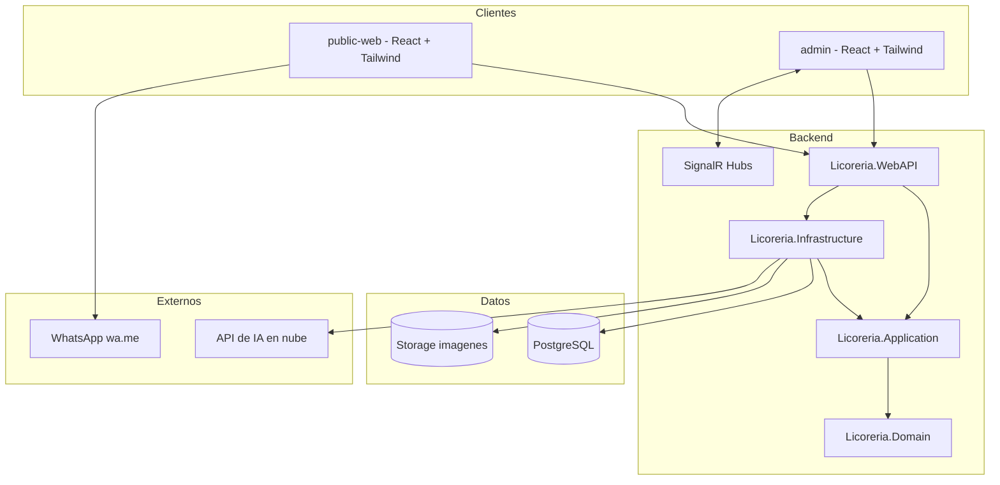
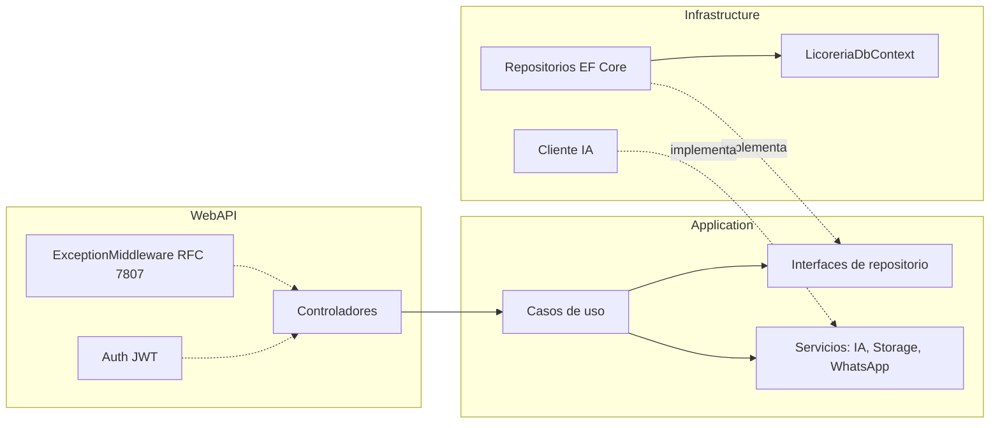

# Diagramas C4

## Nivel 1 · Contexto

```mermaid
flowchart LR
    Cliente[Cliente] -->|Web publica| Pub[Web Publica React]
    Staff[Mesero / Barra / Cocina / Cajero / Admin] -->|Sistema interno| Admin[Panel Interno React]
    Pub --> API[API Licoreria .NET]
    Admin --> API
    API --> DB[(PostgreSQL)]
    API --> IA[Servicio IA - Nube]
    API --> WA[WhatsApp wa.me]
    API --> Storage[(Almacenamiento de imagenes)]
```

## Nivel 2 · Contenedores

```mermaid
flowchart TB
    subgraph Clientes
        PW[public-web - React + Tailwind]
        AW[admin - React + Tailwind]
    end
    subgraph Backend
        API[Licoreria.WebAPI]
        HUB[SignalR Hubs]
        APP[Licoreria.Application]
        DOM[Licoreria.Domain]
        INF[Licoreria.Infrastructure]
    end
    subgraph Datos
        PG[(PostgreSQL)]
        OBJ[(Storage imagenes)]
    end
    subgraph Externos
        LLM[API de IA en nube]
        WAPP[WhatsApp wa.me]
    end

    PW --> API
    AW --> API
    AW <--> HUB
    API --> APP --> DOM
    INF --> APP
    API --> INF
    INF --> PG
    INF --> OBJ
    INF --> LLM
    PW --> WAPP
```

## Nivel 3 · Componentes del backend

```mermaid
flowchart LR
    subgraph WebAPI
        Ctrl[Controladores]
        Mid[ExceptionMiddleware RFC 7807]
        Sec[Auth JWT]
    end
    subgraph Application
        UC[Casos de uso]
        IRepo[Interfaces de repositorio]
        ISvc[Servicios: IA, Storage, WhatsApp]
    end
    subgraph Infrastructure
        DbCtx[LicoreriaDbContext]
        Repo[Repositorios EF Core]
        AiClient[Cliente IA]
    end
    Ctrl --> UC
    Mid -.-> Ctrl
    Sec -.-> Ctrl
    UC --> IRepo
    Repo -.implementa.-> IRepo
    Repo --> DbCtx
    UC --> ISvc
    AiClient -.implementa.-> ISvc
```
