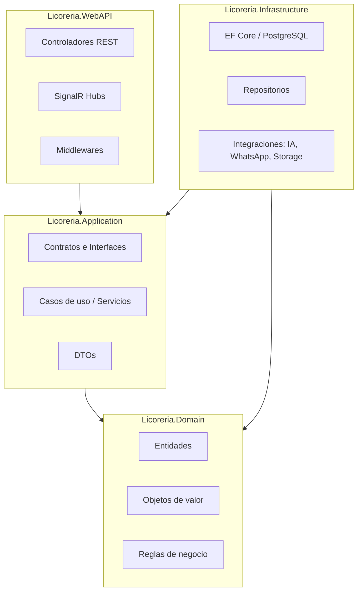
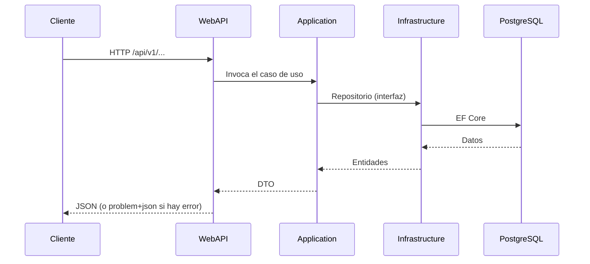

# Onion Architecture

El backend se organiza en **capas concéntricas** donde las capas internas no conocen
a las externas. La regla de dependencias apunta siempre **hacia el dominio**.



## Capas

| Capa | Responsabilidad | Depende de |
| :--- | :--- | :--- |
| **Domain** | Entidades, reglas de negocio y contratos del núcleo. Sin dependencias de frameworks. | — |
| **Application** | Casos de uso, interfaces de repositorios y servicios, DTOs. | Domain |
| **Infrastructure** | Persistencia (EF Core/PostgreSQL), repositorios, integraciones externas. | Application, Domain |
| **WebAPI** | Exposición REST, SignalR, middlewares e inyección de dependencias. | Application, Infrastructure |

## Estructura de proyectos

```
backend/
├── Licoreria.slnx
└── src/
    ├── Licoreria.Domain/           # Entidades y reglas puras
    ├── Licoreria.Application/      # Contratos y casos de uso
    ├── Licoreria.Infrastructure/   # EF Core, repositorios, integraciones
    └── Licoreria.WebAPI/           # API REST, SignalR, middlewares
```

## Reglas

1. **Domain no referencia** a ninguna otra capa ni a paquetes de infraestructura.
2. **Application** solo depende de **Domain**.
3. **Infrastructure** implementa las interfaces definidas en Application.
4. **WebAPI** compone todo mediante inyección de dependencias.
5. Las entidades heredan de `BaseEntity` (identidad `Guid`, auditoría UTC y borrado lógico).
6. Los repositorios se registran como `Scoped` y comparten el `DbContext` por petición.

## Flujo de una petición



## Evolución prevista

- Incorporar **MediatR** para organizar comandos y consultas (CQRS ligero).
- Añadir **FluentValidation** para validación de entrada.
- Introducir un **interceptor de auditoría** para `CreatedBy`/`UpdatedBy`.
- Incorporar **SignalR** para comandas y mesas en tiempo real.
