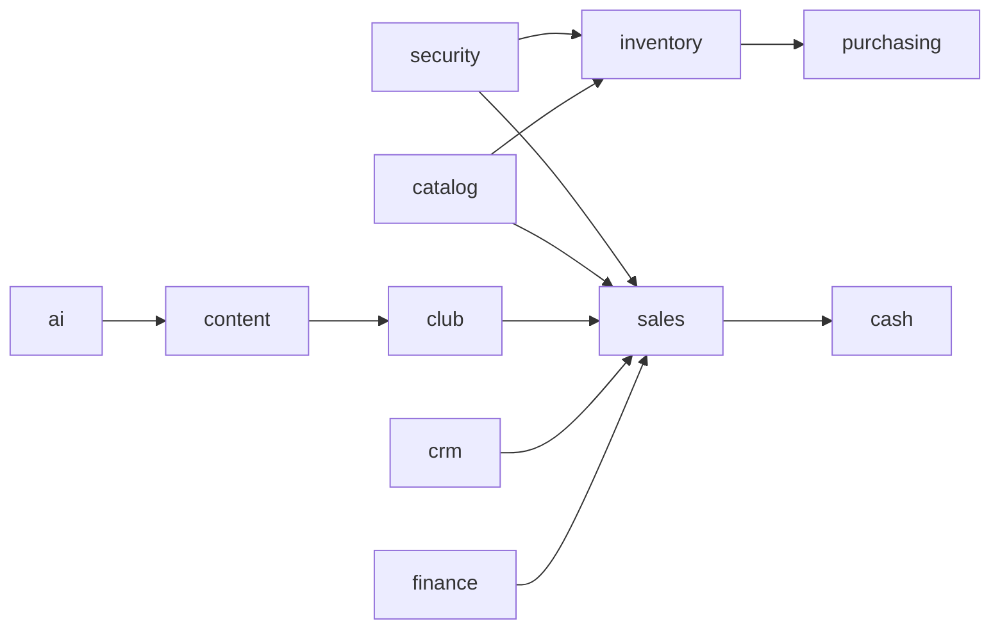
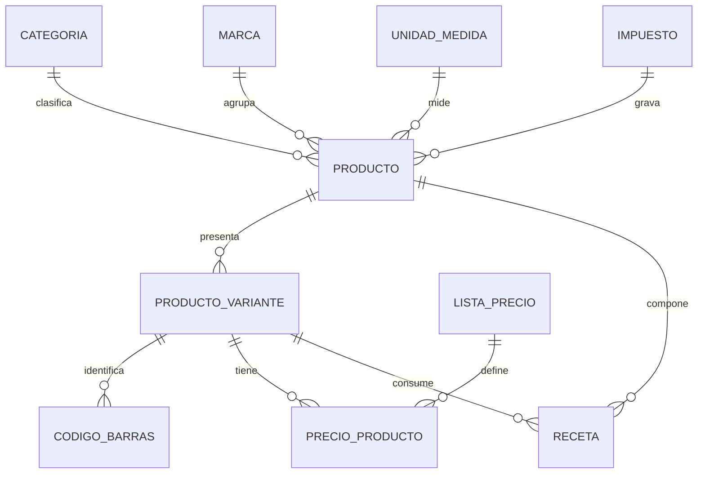
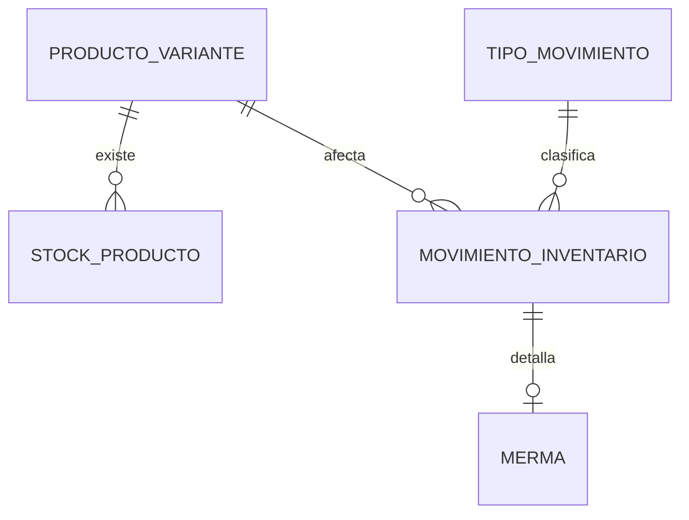
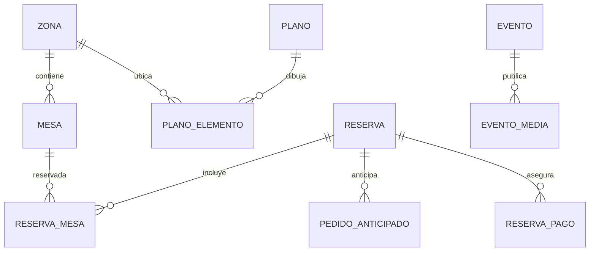
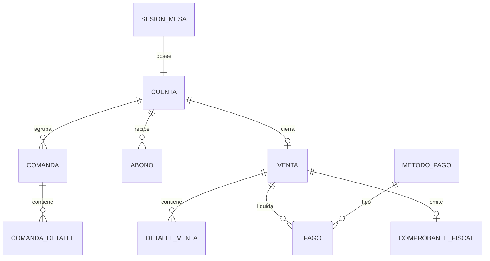
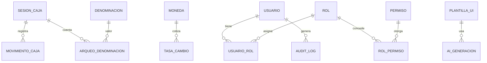

# Modelo Entidad-Relación

El modelo se organiza por **esquemas** (bounded contexts) en PostgreSQL. El sistema es
de **una única sucursal** (ver [ADR 0007](../adr/0007-sucursal-unica.md)).

## Vista general por esquemas

| Esquema | Propósito |
| :--- | :--- |
| `catalog` | Productos, variantes, precios, marcas, impuestos y recetas. |
| `inventory` | Existencias y movimientos (kardex), mermas y cortesías. |
| `purchasing` | Proveedores, órdenes de compra y cuentas por pagar. |
| `sales` | Ventas, comandas, cuentas, abonos, pagos y facturación. |
| `cash` | Sesiones de caja, movimientos y arqueos. |
| `club` | Zonas, plano, mesas, reservas y eventos. |
| `crm` | Clientes, fidelidad y cuentas por cobrar. |
| `finance` | Monedas, tasas de cambio y tesorería. |
| `security` | Usuarios, roles, permisos y auditoría. |
| `content` | Contenido de la web pública y menú digital. |
| `ai` | Trabajos y resultados del módulo de IA. |

## `catalog`

## `inventory`

## `club`

## `sales`

## `cash` / `finance` / `security` / `content` / `ai`

> El detalle de columnas, tipos y restricciones está en
> [`diccionario-datos.md`](diccionario-datos.md) y [`esquemas.md`](esquemas.md).
