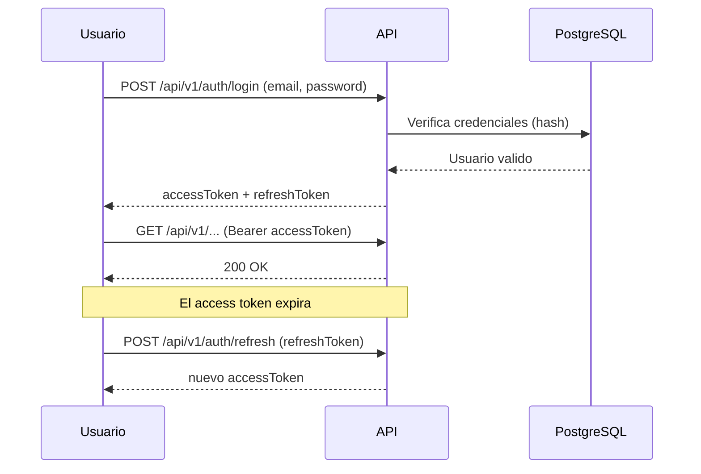

# Autenticación con JWT

El sistema usa **JSON Web Tokens** con un par de tokens: **acceso** y **refresco**
(ver [ADR 0004](../adr/0004-jwt-rbac.md)).

## Flujo

## Tokens

| Token | Vida útil | Uso |
| :--- | :--- | :--- |
| **Acceso** | Corta (15–60 min) | Autoriza cada petición (`Authorization: Bearer`). |
| **Refresco** | Larga (días) | Obtiene nuevos tokens de acceso; revocable. |

### Claims del token de acceso

| Claim | Contenido |
| :--- | :--- |
| `sub` | Identificador del usuario. |
| `email` | Correo del usuario. |
| `role` | Rol o roles del usuario. |
| `permissions` | Permisos concedidos. |
| `exp` / `iat` | Expiración y emisión. |

## Seguridad de credenciales

- Contraseñas almacenadas con **hash fuerte** (bcrypt o Argon2), nunca en claro.
- Política de contraseñas mínima (longitud y complejidad).
- Bloqueo temporal tras intentos fallidos (previsto).

## Endpoints de autenticación

| Método | Ruta | Descripción |
| :--- | :--- | :--- |
| `POST` | `/api/v1/auth/login` | Inicia sesión y devuelve tokens. |
| `POST` | `/api/v1/auth/refresh` | Renueva el token de acceso. |
| `POST` | `/api/v1/auth/logout` | Revoca el token de refresco. |
| `GET` | `/api/v1/auth/me` | Datos del usuario autenticado. |

## Uso del token en el frontend

- El `accessToken` se envía en la cabecera `Authorization: Bearer <token>`.
- El `refreshToken` se almacena de forma segura y se usa para renovar de forma
  transparente.
- Las rutas protegidas redirigen al login cuando no hay sesión válida.

## Auditoría

Los claims alimentan `created_by` y `updated_by` a través del interceptor de EF Core,
de modo que cada cambio queda asociado al usuario autenticado.
