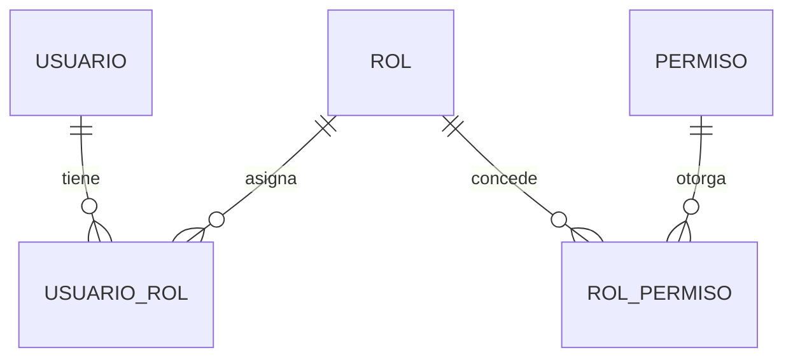

# Control de Acceso por Roles (RBAC)

La autorización se basa en **roles** con **permisos** granulares.

## Roles

| Rol | Descripción |
| :--- | :--- |
| `Administrador` | Control total del sistema. |
| `Cajero` | POS, abonos, cierre de cuentas y caja. |
| `Mesero` | Mesas, comandas, cuentas y reservas asignadas. |
| `Barra` | Comandas de barra y su estado. |
| `Cocina` | Comandas de cocina y su estado. |
| `Host` | Reservas y asignación de mesas. |
| `EditorContenido` | Contenido de la web pública y eventos. |

## Permisos

Los permisos se nombran `modulo:accion`:

| Módulo | Permisos |
| :--- | :--- |
| Catálogo | `catalog:read`, `catalog:write` |
| Inventario | `inventory:read`, `inventory:write`, `inventory:merma` |
| Compras | `purchasing:read`, `purchasing:write` |
| Ventas | `sales:read`, `sales:write`, `sales:void` |
| Cuentas | `account:read`, `account:abono`, `account:close` |
| Caja | `cash:open`, `cash:close`, `cash:movement` |
| Club | `club:read`, `club:manage`, `reservation:manage` |
| CRM | `crm:read`, `crm:write` |
| Finanzas | `finance:read`, `finance:rate` |
| Contenido | `content:read`, `content:publish` |
| IA | `ai:generate`, `ai:approve` |
| Seguridad | `security:users`, `security:roles` |

## Matriz rol × permiso (resumen)

| Permiso | Admin | Cajero | Mesero | Barra | Cocina | Host | Editor |
| :--- | :---: | :---: | :---: | :---: | :---: | :---: | :---: |
| `catalog:read` | ✅ | ✅ | ✅ | ✅ | ✅ | ✅ | ✅ |
| `catalog:write` | ✅ | — | — | — | — | — | — |
| `inventory:read` | ✅ | ✅ | ✅ | ✅ | ✅ | — | — |
| `inventory:merma` | ✅ | ✅ | ✅ | — | — | — | — |
| `sales:write` | ✅ | ✅ | ✅ | — | — | — | — |
| `account:abono` | ✅ | ✅ | — | — | — | — | — |
| `account:close` | ✅ | ✅ | — | — | — | — | — |
| `cash:open` / `cash:close` | ✅ | ✅ | — | — | — | — | — |
| `club:manage` | ✅ | — | — | — | — | ✅ | — |
| `reservation:manage` | ✅ | ✅ | ✅ | — | — | ✅ | — |
| `content:publish` | ✅ | — | — | — | — | — | ✅ |
| `ai:approve` | ✅ | — | — | — | — | — | — |
| `security:users` | ✅ | — | — | — | — | — | — |

## Modelo de datos

## Implementación

- Los roles y permisos viajan como claims en el JWT.
- Los controladores/acciones se protegen con políticas (`[Authorize(Policy = "...")]`).
- El frontend oculta acciones no permitidas, pero la API **siempre** valida el permiso.
