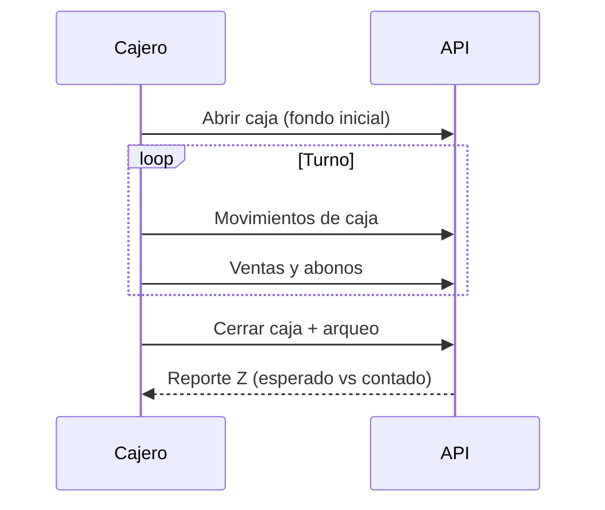

# Módulo · Caja y Turnos

Controla la operación de caja por turno con apertura, movimientos y arqueo.

## Entidades

- `sesion_caja` (apertura, cierre, turno, estado)
- `movimiento_caja` (ingreso/egreso)
- `denominacion`, `arqueo_denominacion`
- `cierre_caja` (consolidado Z)

## Reglas de negocio

1. Solo puede existir **una sesión de caja abierta** a la vez.
2. Cada sesión registra el fondo inicial y el usuario que la abre.
3. Los ingresos/egresos manuales requieren motivo.
4. Al cerrar se realiza el **arqueo por denominaciones**.
5. La diferencia entre lo esperado y lo contado se registra como descuadre.

## Operación en dólares (USD)

La caja opera **solo en dólares**:

- Movimientos y arqueo sin moneda: todo se registra y muestra en USD.
- El arqueo solo muestra **billetes USD** ($1, $5, $10, $20, $50, $100); las
  denominaciones en Bs no se ofrecen.
- Los campos de conteo arrancan vacíos y `Enter` avanza al siguiente billete;
  las etiquetas usan `$` (ej. `$100`).

## Flujo

## Endpoints

| Método | Ruta | Descripción |
| :--- | :--- | :--- |
| `POST` | `/api/v1/sesiones-caja` | Abre una sesión de caja. |
| `GET` | `/api/v1/sesiones-caja/activa` | Sesión abierta actual. |
| `POST` | `/api/v1/sesiones-caja/{id}/movimientos` | Registra ingreso/egreso. |
| `POST` | `/api/v1/sesiones-caja/{id}/cerrar` | Cierra con arqueo (reporte Z). |
