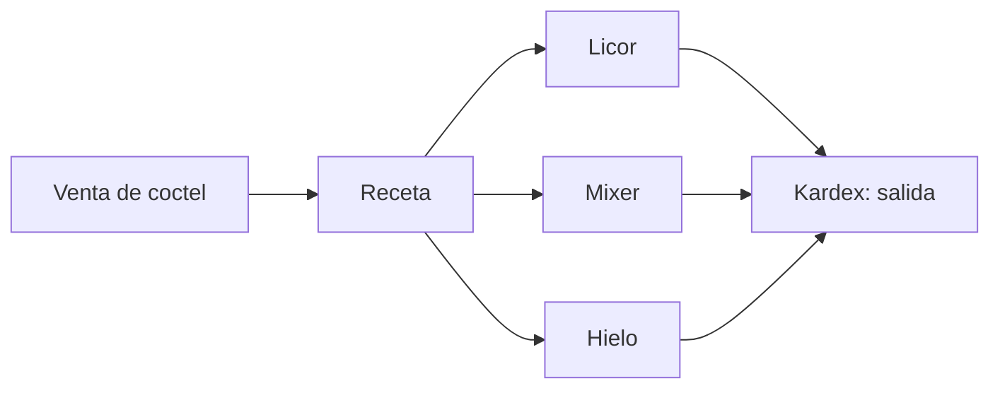

# Módulo · Catálogo

Gestiona todo lo que se vende: productos, presentaciones, precios y composición.

## Entidades

- `marca`, `categoria` (jerárquica), `unidad_medida`, `impuesto`
- `producto`, `producto_variante`, `codigo_barras`
- `lista_precio`, `precio_producto`, `receta`, `modificador`

## Reglas de negocio

1. Un **producto** es la definición base; lo que se vende es una **variante**
   (presentación), que concentra stock y precio.
2. Una variante puede tener **varios códigos de barras**.
3. El precio depende de la **lista** (detal, mayorista, happy hour) y la **moneda**.
4. Los productos preparados (cócteles, tobos) tienen **receta**: al venderse descuentan
   insumos del inventario.
5. Un producto con movimientos no se elimina físicamente: se marca `is_deleted`.
6. Cada producto define su **área destino** (`AreaDestino`: Barra/Cocina) para enrutar
   las comandas automáticamente; por defecto es Barra.

## Formulario coherente para Barra y Cocina

El alta/edición de productos adapta los campos según el área:

- **Barra:** muestra grado alcohólico (opcional) y código de barras por variante.
- **Cocina:** oculta grado alcohólico y código de barras (las comidas no los usan).
- **SKU opcional:** si se deja vacío se autogenera `{PRODUCTO}-{n}` (ej. `TACOS-1`).
- **Tipo sugerido:** en productos nuevos, Cocina sugiere `Preparado` y Barra `Simple`.

## Flujo de venta con receta

## Endpoints

| Método | Ruta | Descripción |
| :--- | :--- | :--- |
| `GET` | `/api/v1/productos` | Lista con filtros y paginación. |
| `GET` | `/api/v1/productos/{id}` | Detalle con variantes. |
| `POST` | `/api/v1/productos` | Crea un producto. |
| `PUT` | `/api/v1/productos/{id}` | Actualiza. |
| `DELETE` | `/api/v1/productos/{id}` | Borrado lógico. |
| `GET` | `/api/v1/categorias` | Categorías jerárquicas. |
| `GET` | `/api/v1/marcas` | Marcas. |
| `GET` | `/api/v1/modificadores` | Modificadores/extras del catálogo. |
| `GET` | `/api/v1/productos/{id}/modificadores` | Modificadores asignados a un producto. |

## Interfaz

- **Web pública:** catálogo y menú con precios en USD/BS.
- **Sistema interno:** CRUD de productos, variantes, precios y recetas.
