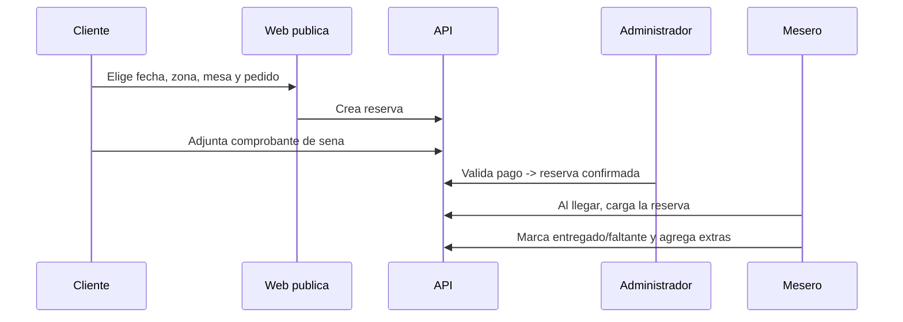

# Módulo · Club, Mesas y Reservas

Gestiona la distribución del local, las reservas y los eventos.

## Entidades

- `zona` (barra pública, mesas, juegos, pista, VIP)
- `plano`, `plano_elemento`
- `mesa`, `silla`
- `reserva`, `reserva_mesa`, `pedido_anticipado`, `reserva_pago`
- `evento`, `evento_media`, `lista_vip`, `entrada`

## Reglas de negocio

1. El **plano** representa zonas y elementos del local con posiciones.
2. Una **mesa** tiene capacidad (sillas), forma y posición.
3. Una reserva puede abarcar **varias mesas**.
4. La reserva puede incluir un **pedido anticipado**.
5. La **seña** se registra con comprobante y queda *pendiente de validación manual*.
6. Al llegar el cliente, el mesero carga la reserva y marca entregado/faltante.

## Flujo de reserva

## Estados de la reserva

`pendiente` → `confirmada` → `asistio` | `cancelada` | `no_asistio`.

## Endpoints

| Método | Ruta | Descripción |
| :--- | :--- | :--- |
| `GET` | `/api/v1/zonas` | Zonas del local. |
| `GET` | `/api/v1/mesas` | Mesas y disponibilidad. |
| `GET` | `/api/v1/planos/{id}` | Plano con elementos. |
| `POST` | `/api/v1/reservas` | Crea reserva (interna o pública). |
| `GET` | `/api/v1/reservas` | Lista/filtra reservas. |
| `POST` | `/api/v1/reservas/{id}/validar-pago` | Valida la seña. |
| `GET` | `/api/v1/eventos` | Eventos publicados. |
