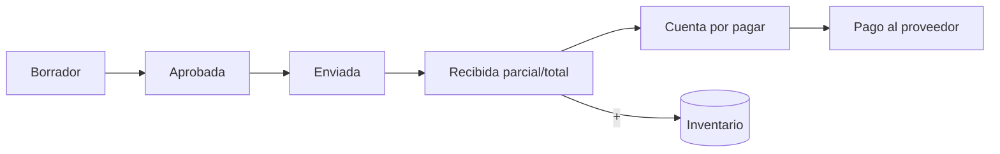

# Módulo · Compras y Proveedores

Gestiona el abastecimiento del local.

## Entidades

- `proveedor` (RIF, contacto)
- `orden_compra`, `orden_compra_detalle`
- `recepcion`
- `cuenta_por_pagar`, `pago_proveedor`

## Flujo de compra

## Reglas de negocio

1. La **recepción** es la que actualiza inventario y costo (no la orden).
2. Se permite recepción **parcial**.
3. La cuenta por pagar se genera al recibir, según condiciones del proveedor.
4. El costo actualizado alimenta el margen del catálogo.

## Endpoints

| Método | Ruta | Descripción |
| :--- | :--- | :--- |
| `GET` | `/api/v1/proveedores` | Lista de proveedores. |
| `POST` | `/api/v1/proveedores` | Crea proveedor. |
| `GET` | `/api/v1/ordenes-compra` | Órdenes con estado. |
| `POST` | `/api/v1/ordenes-compra` | Crea orden. |
| `POST` | `/api/v1/recepciones` | Registra recepción y actualiza inventario. |
| `GET` | `/api/v1/cuentas-por-pagar` | Cuentas pendientes. |
