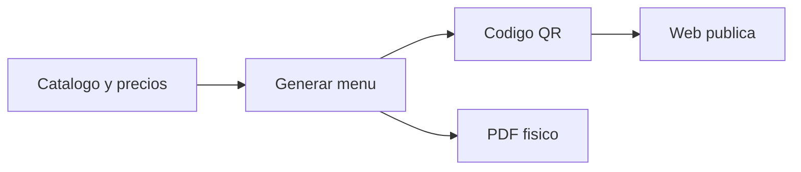

# Módulo · Contenido Web

Permite administrar la web pública sin depender del desarrollador.

## Entidades

- `pagina`, `seccion`, `bloque_contenido`
- `plantilla_ui` (plantillas y design tokens)
- `media_asset` (imágenes y archivos)
- `horario_atencion`, `local_info`
- `menu_digital`, `qr_code`
- `evento`, `evento_media`

## Reglas de negocio

1. El contenido se compone de **secciones** con **bloques** (texto, galería, CTA).
2. Las secciones usan **plantillas** y **design tokens** para no romper la estética.
3. Los **eventos** se publican como una sección temporal.
4. El **menú digital** se genera desde el catálogo y produce QR y PDF.
5. La IA puede proponer secciones; requieren **aprobación** antes de publicar.

## Menú digital

## Endpoints

| Método | Ruta | Descripción |
| :--- | :--- | :--- |
| `GET` | `/api/v1/paginas` | Páginas publicadas. |
| `POST` | `/api/v1/paginas` | Crea página. |
| `GET` | `/api/v1/eventos` | Eventos publicados. |
| `POST` | `/api/v1/eventos` | Crea evento. |
| `GET` | `/api/v1/menu-digital` | Menú digital. |
| `POST` | `/api/v1/menu-digital/qr` | Genera QR del menú. |
| `GET` | `/api/v1/horarios` | Días y horarios. |
