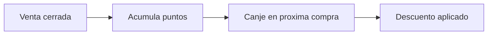

# Módulo · CRM y Clientes

Gestiona la relación con los clientes y la fidelización.

## Entidades

- `cliente` (datos personales y fiscales: RIF/CI)
- `puntos_movimiento` (fidelidad)
- `cuenta_por_cobrar`

## Reglas de negocio

1. Un cliente puede identificarse por RIF/CI; el consumidor final es anónimo.
2. Los **puntos** se acumulan por compra y se canjean como descuento.
3. El crédito a clientes genera `cuenta_por_cobrar` con saldo y vencimiento.
4. El historial permite segmentar (frecuentes, VIP, inactivos).

## Flujo de puntos

## Endpoints

| Método | Ruta | Descripción |
| :--- | :--- | :--- |
| `GET` | `/api/v1/clientes` | Lista con búsqueda. |
| `POST` | `/api/v1/clientes` | Crea cliente. |
| `GET` | `/api/v1/clientes/{id}` | Detalle e historial. |
| `GET` | `/api/v1/clientes/{id}/puntos` | Movimientos de puntos. |
| `GET` | `/api/v1/cuentas-por-cobrar` | Créditos pendientes. |
