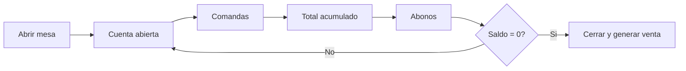

# Módulo · Cuenta y Abonos

Lleva el consumo de una mesa y sus pagos parciales antes del cierre.

## Entidades

- `sesion_mesa` (ocupación)
- `cuenta` (consumo, abonos, saldo)
- `comanda`, `comanda_detalle`
- `abono`

## Reglas de negocio

1. Al abrir una mesa se crea una `sesion_mesa` y su `cuenta`.
2. Cada ítem entregado suma al `total` de la cuenta.
3. Los `abono` reducen el `saldo` (`total − total_abonado`).
4. Una cuenta puede **dividirse** en partes.
5. Al quedar saldo cero se puede **cerrar** y generar la venta.
6. Una línea de **cortesía** suma al consumo pero no al total.

## Flujo

## Estados de la cuenta

`abierta` → `por_cobrar` → `cerrada`.

## Interfaz (monitoreo y cobro)

La página de cuenta está pensada para **monitorear** lo vendido y **cobrar** desde caja:

- **Resumen** con saldo, total, abonado y nº de consumos.
- **Consumos** read-only agrupados por comanda (área Barra/Cocina y estado del ítem).
- **Cobrar** abre un modal con el saldo a cobrar, líneas de pago (método + monto, solo
  USD) y el restante por cubrir; al cerrar se muestra el **ticket**.
- **Acciones secundarias** en modales: **Agregar a la comanda** (ver `catalogo.md`),
  **Abonar** (pago parcial con saldo pendiente y "quedará pendiente") y **Dividir**
  (presets de partes con vista previa).

El listado de cuentas filtra por estado (Todas/Abiertas/PorCobrar/Cerradas).

## Endpoints

| Método | Ruta | Descripción |
| :--- | :--- | :--- |
| `GET` | `/api/v1/cuentas` | Cuentas abiertas. |
| `GET` | `/api/v1/cuentas/{id}` | Detalle con consumos y abonos. |
| `POST` | `/api/v1/cuentas/{id}/abonos` | Registra abono. |
| `POST` | `/api/v1/cuentas/{id}/dividir` | Divide la cuenta. |
| `POST` | `/api/v1/cuentas/{id}/cerrar` | Cierra y genera venta. |
