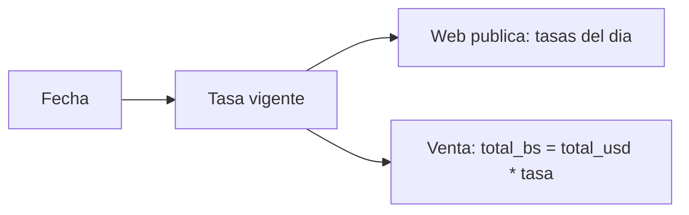

# Módulo · Finanzas y Tesorería

Administra monedas, tasas de cambio y movimientos de tesorería.

## Entidades

- `moneda` (USD, BS)
- `tasa_cambio` (histórico BCV/paralelo por fecha)
- `cuenta_bancaria`
- `movimiento_tesoreria`
- `cierre_caja` (consolidado)

## Reglas de negocio

1. Debe existir **una tasa vigente por fecha** y tipo (BCV/paralelo).
2. Las ventas guardan la tasa aplicada en el momento.
3. Los montos se expresan en USD y su equivalente en BS.
4. Los movimientos de tesorería no alteran la venta, solo el flujo de fondos.

## Tasa de cambio

## Endpoints

| Método | Ruta | Descripción |
| :--- | :--- | :--- |
| `GET` | `/api/v1/monedas` | Monedas soportadas. |
| `GET` | `/api/v1/tasas-cambio` | Histórico de tasas. |
| `GET` | `/api/v1/tasas-cambio/actual` | Tasa vigente. |
| `POST` | `/api/v1/tasas-cambio` | Registra tasa del día. |
| `GET` | `/api/v1/movimientos-tesoreria` | Movimientos. |
