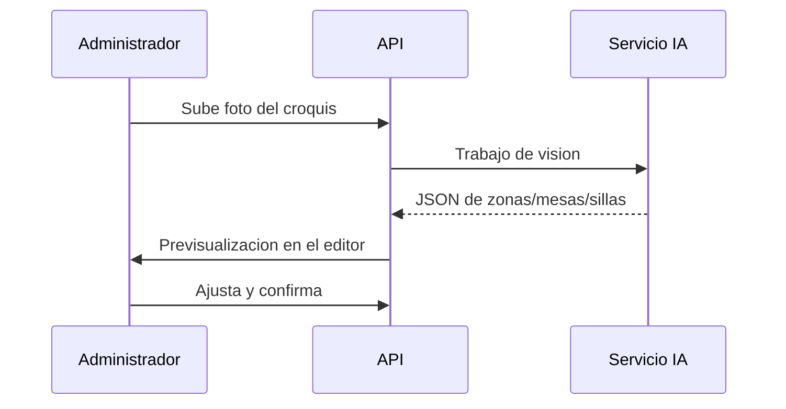

# Módulo · IA

Ver [casos de uso detallados](../08-ia/casos-uso.md). El módulo **no es un chatbot**:
aplica IA a tareas concretas del negocio.

## Entidades

- `ai_generacion` (tipo, estado, entrada/salida, modelo, costo, aprobado)
- `plano_generado`

## Capacidades

| Capacidad | Descripción | Tipo |
| :--- | :--- | :--- |
| Digitalizar plano | Foto de croquis → zonas/mesas/sillas estructuradas. | Visión |
| UI generativa | Secciones web desde plantillas y design tokens. | Texto + plantillas |
| Imágenes | Fotos de platos y posters de eventos. | Generación de imagen |
| Pronóstico | Demanda y sugerencia de reabastecimiento. | Series de tiempo |
| Anomalías | Descuadres de caja y mermas inusuales. | Detección |
| Voz a comanda | Dictado del mesero → comanda estructurada. | Voz |
| OCR de facturas | Factura de proveedor → productos y costos. | Visión/OCR |

## Reglas

1. Todo trabajo se registra en `ai_generacion` (entrada, salida, modelo, costo).
2. Los resultados que afectan la web pública requieren **aprobación humana**.
3. Los trabajos son **asíncronos** (cola) para no bloquear la API.
4. La capa de IA es abstraída en `Application` (ver [ADR 0005](../adr/0005-ia-en-nube.md)).

## Flujo de digitalización de plano

## Endpoints

| Método | Ruta | Descripción |
| :--- | :--- | :--- |
| `POST` | `/api/v1/ai/planos` | Digitaliza un plano desde imagen. |
| `POST` | `/api/v1/ai/secciones` | Genera una sección web. |
| `POST` | `/api/v1/ai/imagenes` | Genera imágenes. |
| `GET` | `/api/v1/ai/generaciones` | Historial de trabajos. |
| `POST` | `/api/v1/ai/generaciones/{id}/aprobar` | Aprueba un resultado. |
