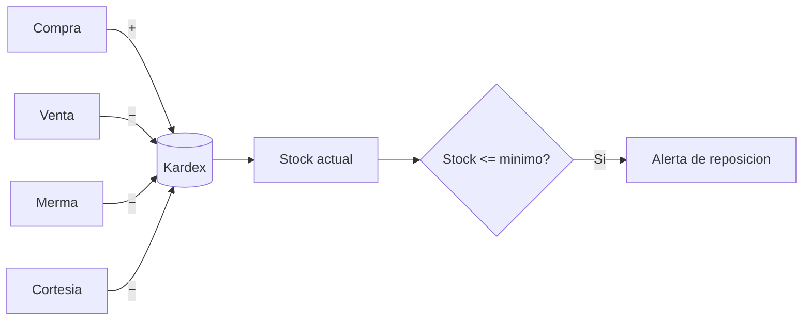

# Módulo · Inventario

Controla las existencias mediante un **kardex** de movimientos inmutables.

## Entidades

- `stock_producto` (existencia por variante)
- `tipo_movimiento` (compra, venta, ajuste, merma, cortesía, consumo interno)
- `movimiento_inventario` (kardex)
- `lote`, `ajuste_inventario`, `toma_fisica`

## Reglas de negocio

1. El stock **no se sobrescribe**: cada cambio genera un `movimiento_inventario`.
2. La existencia actual (`stock_producto.cantidad`) es la suma del kardex.
3. Los movimientos son **inmutables**; un error se corrige con un movimiento inverso.
4. Toda salida por venta, merma o cortesía descuenta inventario.
5. Se alerta cuando `cantidad <= stock_minimo`.

## Tipos de movimiento

| Tipo | Signo | Origen |
| :--- | :---: | :--- |
| Compra | + | Recepción de orden de compra. |
| Venta | − | Cierre de venta / comanda entregada. |
| Ajuste | ± | Corrección manual autorizada. |
| Merma | − | Producto dañado/vencido (ver [merma](merma-cortesia.md)). |
| Cortesía | − | Reposición o invitación sin cobro. |
| Consumo interno | − | Consumo del personal. |

## Flujo

## Endpoints

| Método | Ruta | Descripción |
| :--- | :--- | :--- |
| `GET` | `/api/v1/stock` | Existencias con alertas. |
| `GET` | `/api/v1/movimientos-inventario` | Kardex filtrable. |
| `POST` | `/api/v1/ajustes-inventario` | Ajuste autorizado. |
| `POST` | `/api/v1/tomas-fisicas` | Conteo físico. |
