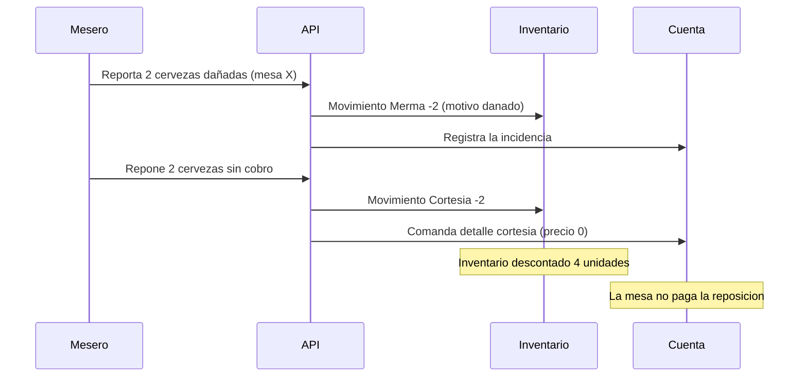

# Módulo · Merma y Cortesía

Caso de negocio central del local: bebidas que se **dañan o se parten** no se venden,
pero deben descontarse del inventario, y a veces se reponen **sin cobro** a la mesa.

## Escenario

> A una mesa se le salieron **dos cervezas dañadas**. Esas dos se descuentan del
> inventario y se le entregan **dos más sin cobro**, que también se descuentan.

## Modelo

- `movimiento_inventario` con tipo **Merma** → baja por el daño.
- `movimiento_inventario` con tipo **Cortesía** → baja por la reposición sin cobro.
- `merma` detalla el motivo (`danado`, `partido`, `vencido`) y si hubo reposición.
- `comanda_detalle` con `es_cortesia = true` → línea a precio cero en la cuenta.

## Flujo

## Reglas

1. La merma **siempre** descuenta inventario.
2. La reposición sin cobro genera cortesía (también descuenta) y **no** se cobra.
3. El reporte de pérdidas agrupa por motivo, producto y mesero.
4. El administrador puede exigir autorización para mermas sobre un umbral (previsto).

## Endpoints

| Método | Ruta | Descripción |
| :--- | :--- | :--- |
| `POST` | `/api/v1/mermas` | Registra una merma y su posible reposición. |
| `GET` | `/api/v1/mermas` | Lista con filtros (motivo, fecha, mesero). |
| `GET` | `/api/v1/reportes/mermas` | Reporte de pérdidas. |

## KPIs asociados

- Unidades y costo total de mermas por período.
- Porcentaje de merma sobre ventas.
- Mermas por motivo y por responsable.
