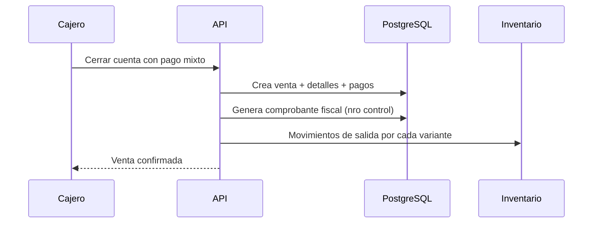

# Módulo · Ventas y POS

Registra las ventas y expone el punto de venta del cajero.

## Entidades

- `metodo_pago`
- `venta`, `detalle_venta`, `pago`
- `comprobante_fiscal`, `libro_venta`
- `devolucion`, `promocion`

## Reglas de negocio

1. Toda venta aplica la **tasa de cambio** vigente y guarda `total_usd` y `total_bs`.
2. Se admite **pago mixto**: varias filas en `pago` para una misma venta.
3. Al cerrar una cuenta se genera la `venta` y su `comprobante_fiscal`.
4. La devolución genera nota de crédito y reintegra inventario (según política).
5. Los descuentos requieren permiso y quedan auditados.

## Flujo de venta

## POS

- Vista de mesas y cuentas abiertas.
- Añadir ítems a una mesa.
- Registrar abonos y cobrar saldo.
- Atajos y búsqueda por código de barras.

## Endpoints

| Método | Ruta | Descripción |
| :--- | :--- | :--- |
| `POST` | `/api/v1/ventas` | Registra una venta. |
| `GET` | `/api/v1/ventas` | Lista con filtros por fecha/turno. |
| `GET` | `/api/v1/ventas/{id}` | Detalle. |
| `POST` | `/api/v1/ventas/{id}/pagos` | Registra pagos (mixto). |
| `POST` | `/api/v1/ventas/{id}/devoluciones` | Devolución / nota de crédito. |
| `GET` | `/api/v1/metodos-pago` | Métodos disponibles. |
