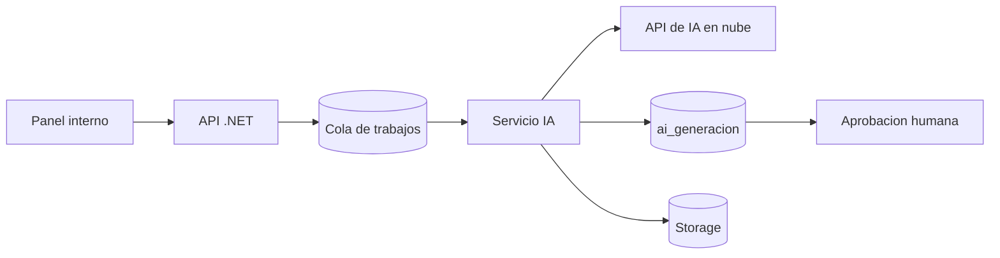

# Casos de Uso de IA

El módulo de IA aplica modelos a tareas concretas del negocio. **No es un chatbot.**
Toda generación se registra en `ai_generacion` y, cuando afecta la web pública, requiere
aprobación humana.

## 1. Digitalización del plano desde papel

**Problema:** diseñar el plano del local a mano en un editor es lento.
**Solución:** el administrador sube una **foto del croquis** y un modelo de visión
extrae zonas, mesas y sillas como JSON estructurado, que se carga en el editor.
**Tipo:** visión por computador.

## 2. UI generativa de eventos

**Problema:** publicar un evento no debe requerir al desarrollador.
**Solución:** el administrador describe el evento; la IA **selecciona una plantilla** y
rellena los espacios (título, fotos, fechas, CTA) respetando **design tokens** y
restricciones para no romper la estética.
**Tipo:** texto + sistema de plantillas (*constrained generative UI*).

## 3. Generación de imágenes

**Problema:** faltan fotos atractivas de platos y bebidas, y posters de eventos.
**Solución:** generación de imágenes con el estilo visual del local.
**Tipo:** generación de imagen.

## 4. Pronóstico de demanda y reabastecimiento

**Problema:** comprar de más o de menos.
**Solución:** predicción de ventas por día/evento y sugerencia de cantidades de compra
y stock mínimo dinámico.
**Tipo:** series de tiempo.

## 5. Optimización de precios / happy hour

**Problema:** promociones a ciegas.
**Solución:** análisis de elasticidad y sugerencia de precios/promociones.
**Tipo:** analítica predictiva.

## 6. Detección de anomalías y fraude

**Problema:** descuadres de caja, mermas inusuales, cancelaciones sospechosas.
**Solución:** detección de patrones anómalos y alertas al administrador.
**Tipo:** detección de anomalías.

## 7. CRM predictivo

**Problema:** no saber a quién dirigir ofertas.
**Solución:** segmentación de clientes, predicción de próxima visita y ofertas
personalizadas.
**Tipo:** segmentación y recomendación.

## 8. Optimización de mesas y reservas

**Problema:** mesas mal asignadas o sobreventa.
**Solución:** sugerencia de mejor acomodo y prevención de conflictos de reserva.
**Tipo:** optimización.

## 9. Voz a comanda

**Problema:** escribir comandas en hora pico es lento.
**Solución:** el mesero dicta y se genera la **comanda estructurada**.
**Tipo:** reconocimiento de voz + NLP.

## 10. OCR de facturas de proveedor

**Problema:** cargar productos y costos manualmente.
**Solución:** leer la factura y generar las líneas de recepción.
**Tipo:** visión/OCR.

## 11. Asistente de menú

**Problema:** descripciones pobres o ausentes.
**Solución:** redacción de descripciones, alérgenos y traducción.
**Tipo:** generación de texto.

## Arquitectura

## Política de uso

- Los resultados no se publican sin **aprobación** cuando son visibles al público.
- Se registra modelo, costo y entrada/salida de cada trabajo.
- La capa de IA es reemplazable (ver [ADR 0005](../adr/0005-ia-en-nube.md)).
