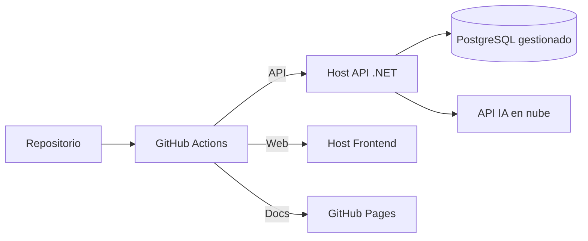

# Entornos y Operaciones

## Entornos

| Entorno | Propósito | Base de datos |
| :--- | :--- | :--- |
| **Desarrollo** | Trabajo local. | PostgreSQL en Docker. |
| **Pruebas (CI)** | Validación automática. | PostgreSQL efímero. |
| **Producción** | Operación real del local. | PostgreSQL gestionado. |

## Configuración

- Toda la configuración sensible se pasa por **variables de entorno**.
- Plantilla en [`.env.example`](../../../.env.example); el `.env` real no se versiona.
- Cadenas de conexión y claves de IA **nunca** en el repositorio.

## Ejecución local

```bash
task db:up              # PostgreSQL + pgAdmin
task backend:run        # API .NET
task frontend:dev       # Apps React
task docs:dev           # Sitio de documentacion
```

## CI/CD (previsto)

| Flujo | Disparador | Acciones |
| :--- | :--- | :--- |
| `backend` | Push / PR | Restore, build y test. |
| `frontend` | Push / PR | Install, lint, build. |
| `docs` | Push a `master` | Build y deploy del sitio a GitHub Pages. |

## Despliegue (Fase 5)



## Observabilidad

- Logs estructurados con niveles por entorno.
- Correlación de peticiones por identificador.
- Manejo global de errores con RFC 7807 (ver [errores](../04-api/errores-rfc7807.md)).

## Respaldos

- `pg_dump` programado; almacenamiento fuera del repositorio.
- Procedimiento de restauración documentado en `database/scripts`.
