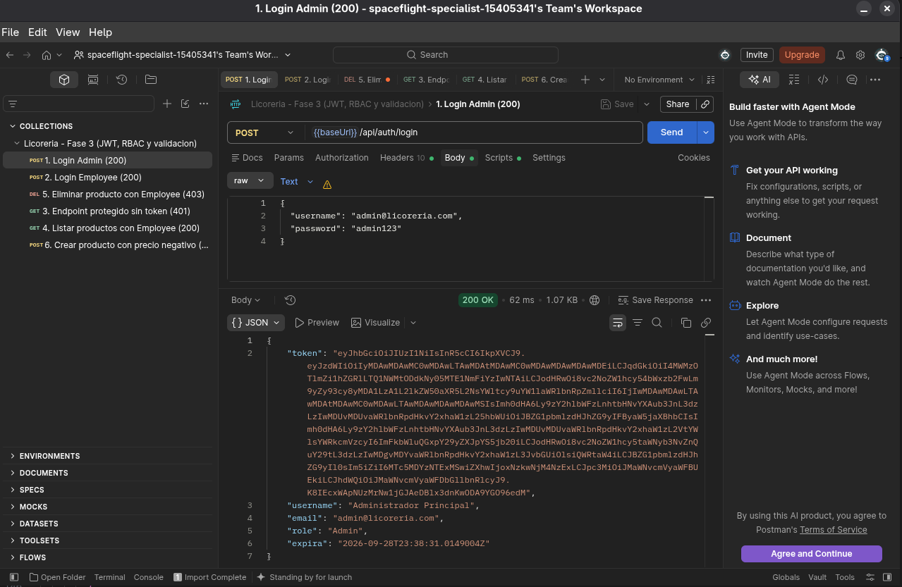
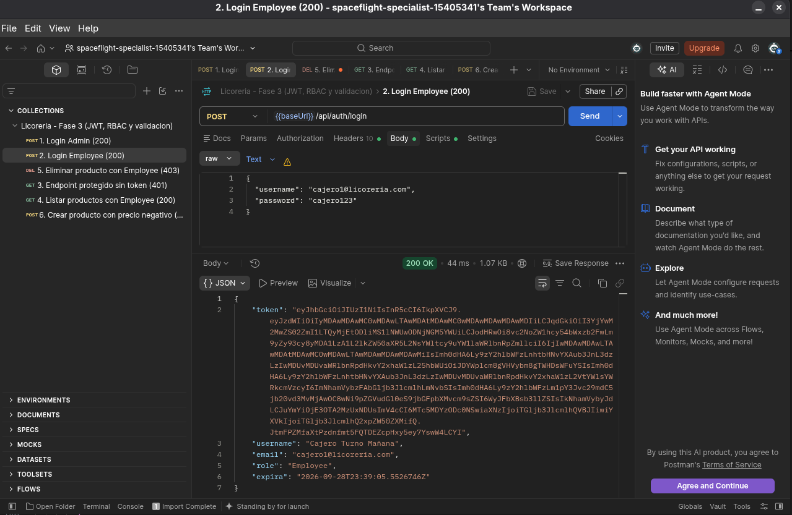
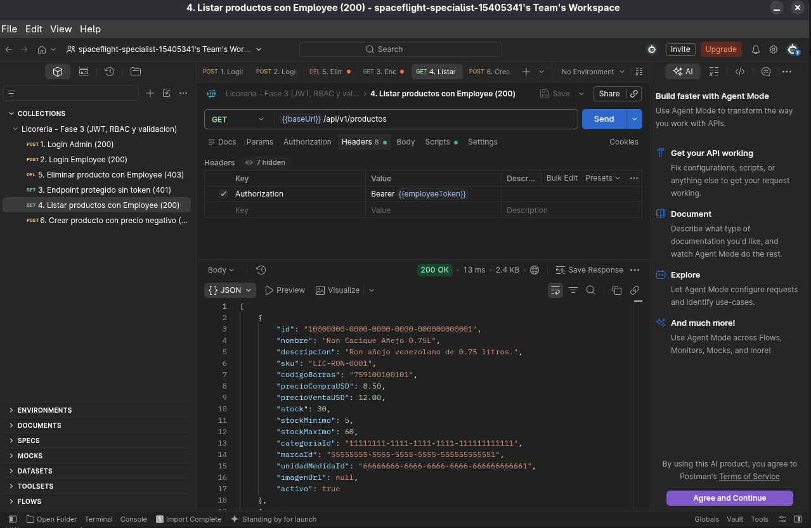
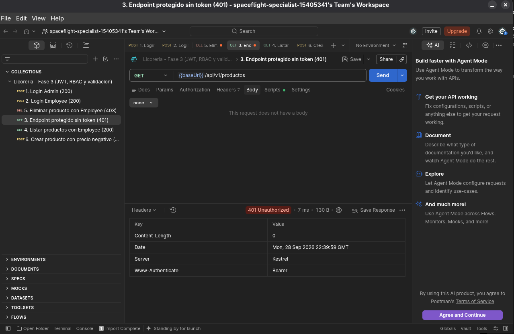
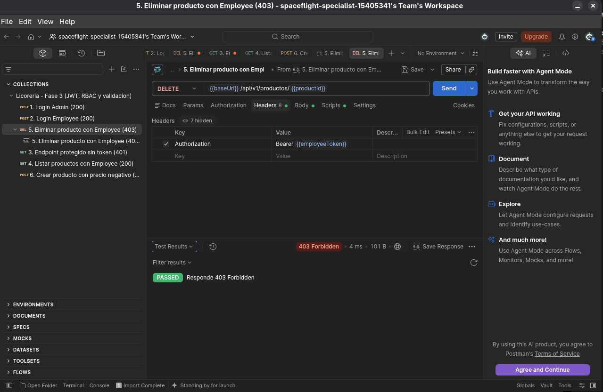
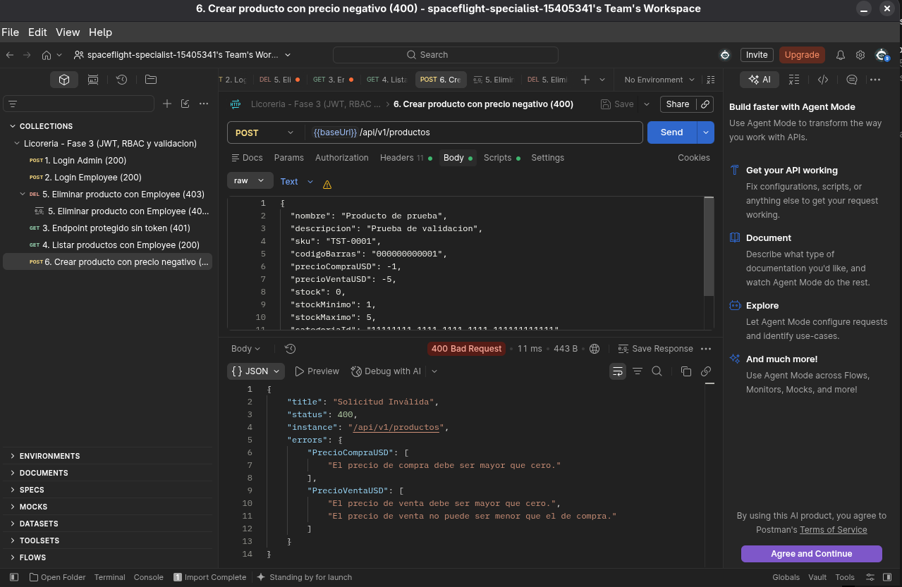

# Fase 3 · Seguridad Stateless (JWT), RBAC y Validación Defensiva

Implementación del subsistema de seguridad de la API: autenticación **stateless** con
**JWT**, autorización por roles (**RBAC**) y protección de entradas con
**FluentValidation**.

## Objetivo

Garantizar que solo usuarios autenticados y con el rol adecuado puedan operar, y que
toda entrada se valide antes de llegar al dominio.

## Autenticación JWT

- Endpoint: `POST /api/auth/login` con `LoginDto` (`Username`, `Password`).
- Respuesta `AuthResponseDto`: `Token`, `Username`, `Email`, `Role`, `Expira`.
- Token firmado con **HMAC-SHA256** (`ITokenService`).
- Claims: `NameIdentifier`, `Name`, `Email`, `Role` y expiración.
- Clave secreta en `appsettings.json` (sección `Jwt`) o variables de entorno
  (`Jwt__Key`), nunca hardcodeada en el código.

## Hash de contraseñas

- `IPasswordHasher` + `PasswordHasher` con **PBKDF2 (SHA-256) + salt**.
- Formato almacenado: `iteraciones.saltBase64.hashBase64`.
- Cumple "SHA-256 o superior".

## Roles y RBAC

El JWT incluye el **rol de seguridad** (`Admin` / `Employee`) y el **rol de dominio**
(`Administrador`, `Cajero`, `Mesero`, `Barra`, `Cocina`, `Host`, `EditorContenido`).

| Acción | Atributo | Roles permitidos |
| :--- | :--- | :--- |
| Consultar / crear | `[Authorize(Roles = "Admin,Employee")]` | Todos los autenticados |
| Eliminar | `[Authorize(Roles = "Admin")]` | Solo `Admin` |

Respuestas HTTP:

- **401 Unauthorized** sin token o token inválido.
- **403 Forbidden** con rol insuficiente (p. ej. `Employee` intentando eliminar).

## Validación defensiva

- Validadores `AbstractValidator<T>` en `Licoreria.Application/Validators`.
- Reglas: precios > 0, stock ≥ 0, stock máximo > stock mínimo, textos obligatorios con
  longitud máxima.
- Filtro global `ValidationFilter`: responde **400 Bad Request** con
  `ValidationProblemDetails` y los errores por campo.

## Credenciales de prueba

| Usuario | Contraseña | Rol de dominio | Rol de seguridad |
| :--- | :--- | :--- | :--- |
| `admin@licoreria.com` | `admin123` | Administrador | `Admin` |
| `cajero1@licoreria.com` | `cajero123` | Cajero | `Employee` |

## Evidencia (Postman)

**1. Login exitoso con rol Admin:**

**2. Login exitoso con rol Employee:**

**3. Listar productos con token Employee (200):**

**4. Endpoint protegido sin token (401 Unauthorized):**

**5. Intento de eliminación con rol Employee (403 Forbidden):**

**6. Producto con precio negativo (400 Bad Request con validación):**

> Colección Postman:
> [`Licoreria_Fase3_Postman_Collection.json`](../../assets/evidencias/Licoreria_Fase3_Postman_Collection.json).

## Cómo probar

1. Levanta la API (`dotnet run --project backend/src/Licoreria.WebAPI`).
2. Importa la colección Postman y ejecuta en orden los 4 escenarios:
   login (Admin/Employee) → endpoint sin token (401) → eliminar con Employee (403) →
   crear con precio negativo (400).

## Rúbrica cumplida

| Criterio | Evidencia |
| :--- | :--- |
| Autenticación JWT y claims | `POST /api/auth/login` con HMAC-SHA256 y claims de usuario/email/rol. |
| Matriz de permisos RBAC | `[Authorize(Roles=...)]`; 401 sin token y 403 con rol insuficiente. |
| Validadores FluentValidation | Validadores desacoplados + 400 con errores detallados. |
| Evidencias Postman | Los 4 escenarios capturados. |

## Documentación relacionada

- [Autenticación JWT](../05-seguridad/jwt.md)
- [Control de acceso por roles (RBAC)](../05-seguridad/rbac.md)
- [Errores RFC 7807](../04-api/errores-rfc7807.md)
- [Evidencias por fase](../../assets/evidencias/README.md)
